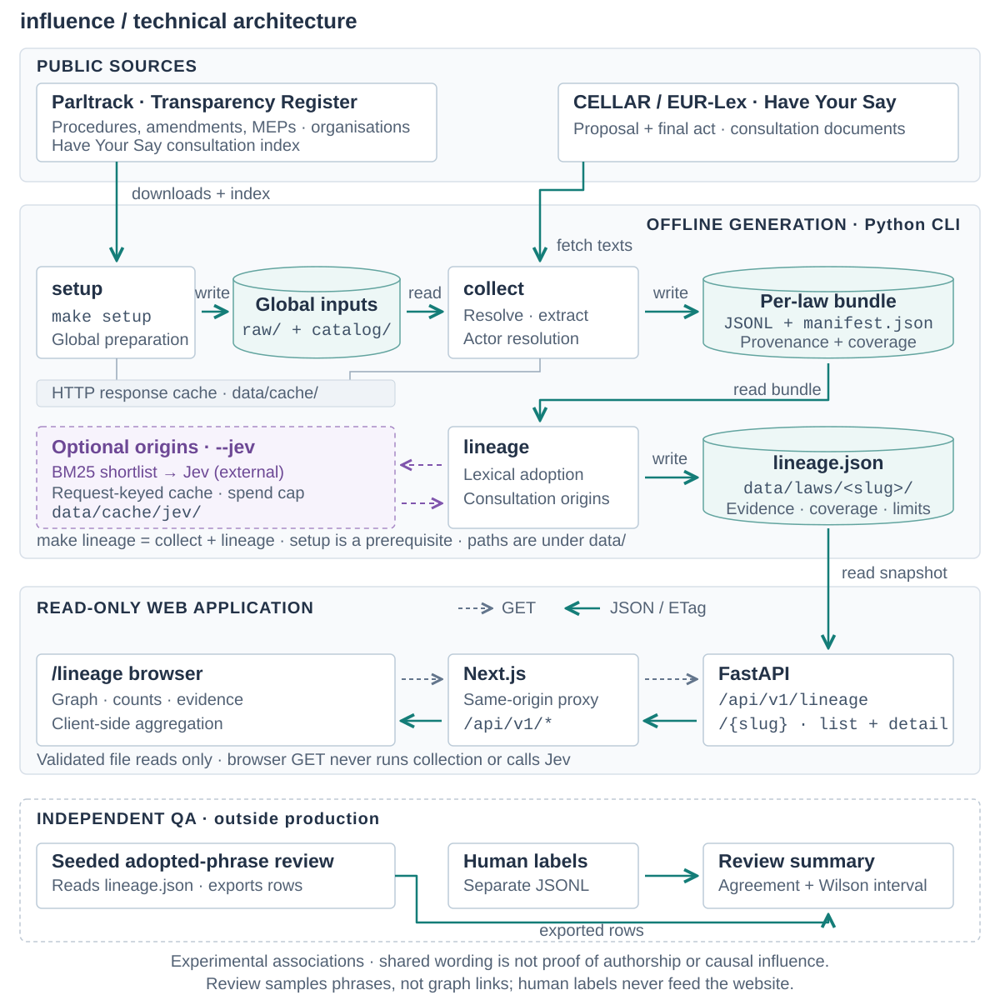

# influence

**influence** is our entry for Reversa's track at the Madrid Open (Saturday 3 October 2026,
Mad Tech Campus). The organizers called Challenge 03 **The Influence Atlas**; our project
is named **influence**. It is an open, public map of who shapes
EU law since 2019. The lineage website traces wording from the final law through
amendments to consultation documents, with counts and recorded limitations. Shared
wording and model judgments do not establish causal influence. Forecasts and the older
ask-first Atlas pipeline are no longer supported.

The organizers replaced the first Challenge 03 brief (Influence Graph: score 60 supplied
pairs into CSVs) at kickoff on 3 October 2026. The
[Atlas brief](docs/brief/influence-atlas-challenge-brief.pdf) is the one that counts; the
[first brief](docs/brief/madrid-open-reversa-challenges.pdf) is kept for the record.

## Architecture

One data path powers the website. A command builds a saved view for each law; the web
application reads that view and turns its records into a graph, counts and evidence cards.



[Open the full-size diagram](docs/architecture/influence-lineage.svg).

1. **Prepare the public inputs.** `make setup` downloads Parltrack's law, amendment and
   Member of Parliament records, the Transparency Register, and the Have Your Say
   consultation index. It keeps source URLs, retrieval times and file hashes.
2. **Collect one law.** `make lineage LAW='AI Act'` first runs collection: resolve the
   query, fetch proposal and final-act texts through CELLAR, read amendments, extract
   consultation passages, and resolve actors. Per-law records, coverage and a run
   manifest are saved under `data/laws/<slug>/`. `make collect` can run this step alone.
3. **Trace wording.** The lineage engine looks for new final-act wording carried by
   amendments, then matches consultation documents to adopted and tabled wording. With
   `--jev`, a BM25 word-search shortlist feeds cached, budget-limited Jev judgments of
   reworded consultation origins. Amendment-to-final-act adoption remains lexical.
4. **Save the result.** `lineage.json` contains phrases, amendment links, consultation
   origins, holder credits, source spans, counts, coverage and limitations. Missing
   proposal or final text produces an explicit `unknown` result, and origin searches
   are skipped. New snapshots use `lineage-2` with exact lexical carrier supports; legacy `lineage-1`
   snapshots remain readable without fabricated evidence.
5. **Serve and explore.** FastAPI reads saved views at `GET /api/v1/lineage` and
   `GET /api/v1/lineage/{slug}`. Next.js proxies these requests; the `/lineage` browser
   page derives its graph layout and organisation aggregates from the returned records.
   Browsing does not collect data or call a model.

| Responsibility | Implementation |
| --- | --- |
| Commands and collection | [CLI](backend/src/influence/cli.py), [setup](backend/src/influence/services/setup.py), [collect](backend/src/influence/services/collect.py), [source connectors](backend/src/influence/repositories/) |
| Wording and consultation matches | [lexical adoption](backend/src/influence/services/lineage.py), [origins](backend/src/influence/services/origin.py), [optional Jev origins](backend/src/influence/services/lineage_jev.py) |
| Saved view and API | [assembly](backend/src/influence/services/lineage_assembly.py), [schema](backend/src/influence/schemas/lineage.py), [view reader](backend/src/influence/services/lineage_views.py), [routes](backend/src/influence/routers/lineage.py) |
| Website | [API proxy](frontend/next.config.ts), [lineage page](frontend/app/lineage/page.tsx), [graph](frontend/lib/lineage-graph.ts), [aggregates](frontend/lib/lineage.ts) |
| Independent quality review | [lineage review tool](backend/src/influence/practice/lineage_review.py): sample adopted-phrase claims, export them for readers, and summarise separately stored labels |

The review tool and automated tests are retained quality tools. Review labels never alter
`lineage.json` or feed the website. The review tool samples adopted phrases, which differs
from the graph's displayed population; its precision covers resolved reader agreements.
Its existence is not evidence that a review has been completed or an accuracy gate passed.

Shared wording and model judgments do not prove authorship or causal influence. The
[repository review](docs/reviews/repository-consistency-2026-10-07.md) records remaining
lineage accuracy and presentation issues; this cleanup does not resolve those findings.
The current runtime does not read or produce `atlas.json`. Earlier architecture documents
remain available as historical records.

## Competition Background — 3 October 2026

There is no hidden test and no supplied data. The jury scores 100 points live at 19:30:

| Criterion | Points | What the jury does |
| --- | ---: | --- |
| Real links | 25 | Picks 3 links from our graph at random and reads both texts side by side |
| Any law | 20 | Names an EU law on the spot; our system shows who shaped it, with no code changes |
| Insight | 25 | Reads our answers to five questions: who, on what, towards what, how, what next |
| Report | 15 | Reads our public report and opens this repository |
| Ambition | 15 | How much of Europe since 2019 we cover, and our forecast |

The original challenge requested a graph, a report and an open repository. The owner
subsequently narrowed the maintained product to the lineage website on 7 October. The
challenge documents remain historical context; [implementation status](docs/implementation-status.md)
and the [backend guide](backend/README.md) define the supported system.

## Quickstart

You need Python 3.14 and uv 0.12 or later (the Makefile's `UV_EXCLUDE_NEWER` setting needs
it); the [backend README](backend/README.md) has the details. From the repository root:

```sh
make setup                        # once per machine, needs network: Parltrack dumps, the
                                  # Transparency Register and the Have Your Say index
make lineage LAW='AI Act'         # collect and trace wording for the /lineage explorer
```

With Docker installed, one command builds and serves the API and the explorer:

```sh
make up                                # http://localhost:3000, reading data/
INFLUENCE_DATA=./mock-data make up     # the committed snapshots instead of data/
INFLUENCE_LOG_LEVEL=debug make up      # more API log lines (default info)
```

`LAW` takes a procedure number (`2021/0106(COD)`), a CELEX or COM reference, a common
name (`'AI Act'`, `'DSA'`) or a title. Every output is written under
`data/laws/<procedure>/` (for the AI Act, `data/laws/2021-0106-COD/`): `lineage.json`, beside the collected texts,
amendments, submissions and a run manifest. `data/` is never committed; everything in it
comes from public sources and is rebuilt by these commands. `make check` runs the local quality gates; Docker verification is separate (`make check-containers`).

## Licence

The code and documentation in this repository are licensed under the
[Apache License, Version 2.0](LICENSE) (decision D6 in
[implementation status](docs/implementation-status.md#decisions)). Everything the
pipeline writes under `data/`, and the snapshots under `mock-data/`, is derived from
public sources and stays under those sources' terms: Parltrack's dumps are
[ODbL 1.0](https://opendatacommons.org/licenses/odbl/1-0/), and EUR-Lex texts and
Have Your Say feedback fall under the
[Commission's reuse policy](https://eur-lex.europa.eu/content/legal-notice/legal-notice.html).
The public report, once published, is offered under
[CC BY 4.0](https://creativecommons.org/licenses/by/4.0/).

## Where to Start

- [AGENTS.md](AGENTS.md): how we work, for humans and AI agents alike: the four project
  rules, the PR format, testing and evaluation, and the commands.
- [SUPPLY-CHAIN-SECURITY.md](SUPPLY-CHAIN-SECURITY.md): rules for adding dependencies.
- [Backend guide](backend/README.md): run the evidence API, obtain the public snapshot,
  understand the layers and scoring limits, and verify the implementation.
- [Frontend guide](frontend/README.md): run the lineage website and connect it to the API.
- [The influence explainer](docs/explainer/influence-atlas-primer.md): historical challenge
  context, the broader original design and its research; the architecture above describes
  the maintained product.
- [The first explainer](docs/explainer/influence-graph-primer.md): written for the first
  brief. Its background on EU law-making, amendments, lobbying and the boilerplate trap
  still holds.

The repository layout is described in AGENTS.md.
