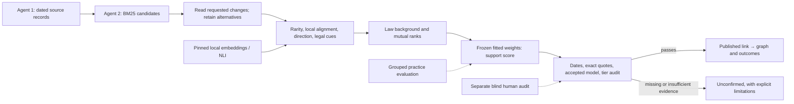

# Calculation Implementation and Evaluation

The calculation belongs to parts 3 (find candidates), 4 (verify links), and the
practice loop of the [consolidated plan](../plan.md). It extends Agent 2's merged
retrieval, passage-change reader, assessment and audit services. The existing graph
and outcome aggregation consume its `LinkAssessment` records. The user authorized
local model evaluation on 3 October 2026, with **no paid API**.

## What the Number Means

An amendment changes a legal rule. A lobby passage may request the same change,
quote the original rule, discuss the same topic, or request the opposite outcome.
These cases need different evidence. A high similarity score alone cannot distinguish
them and is not a probability that lobbying caused the amendment.

The calculation extracts insertions and deletions, removes long quotations of known
proposal text from ordinary-prose matching, and computes independent clues. A logistic
regression learns how those clues combine from public practice labels. Its sigmoid
output is a **support score**. It is not calibrated influence probability. Neither the
score nor a language model alone can authorize a published edge.

## Calculation Contracts

| Component | Calculation and contract |
| --- | --- |
| Quoted-law masking | `masking.py` blanks every matching run of at least eight words from a known proposal. Case and punctuation differences do not turn quotations into original authorship. Character positions remain unchanged; displayed evidence always uses original source text. |
| Lexical overlap | Reuses `score_pair`: overlap between insertions on both sides and deletions on both sides. Unchanged original wording is not an edit. |
| Rarity | `signals.py` weights shared changed phrases using training-document inverse frequency: `log((N+1)/(df+1))+1`. Repetition within one document does not increase its document frequency. The training corpus has a reproducible fingerprint. |
| Local alignment | Same-operation token alignment, retaining short edits and separately recording their limited evidence. See the function docstring for the exact algorithm and bounds. |
| Direction and legal cues | Insertion/deletion agreement plus negation, modal obligation/permission and numeric-bound conflicts in comparable changed clauses. These English heuristics do not prove equivalence; a missing cue does not mean agreement. |
| Semantic similarity | Cosine between normalized, pinned local embeddings of the changes. Empty changes have missing semantic evidence, never a fabricated zero vector. Cosine can confuse topic overlap with the same legal request. |
| NLI judge | A local natural-language-inference model supplies entailment, contradiction and neutral scores. Model probabilities describe its labels, not influence probability. All three are saved separately from human or practice labels. |
| Background | `ranking_signals.py` computes `(score−law_mean)/law_std`; constant pools return zero. Forward ranks compare asks for one amendment; reverse ranks compare amendments for one ask. Ties receive the same competition rank. Mutual reciprocal rank is `2/(forward_rank+reverse_rank)`. |
| Retrieval fusion | Sum `1/(60+rank)` across ranked lists, deduplicating an ID within each list. This is implemented and evaluated, but is not selected merely because it uses more models. |
| Fitted support | `calibration.py` standardizes using training data only, then fits an L2-regularized logistic model. Feature order, means, scales, coefficients, convergence and training provenance are serialized. Missing required signals or nonconvergence are explicit errors. |
| Threshold diagnostics | Complete score ties are selected together, against an explicit minimum sample and Wilson lower precision bound. No passing cutoff returns `None`. Pooled out-of-fold cutoffs are diagnostics across several models, not a deployable cutoff for a new all-data fit. |
| Publication | `calculation.py` requires an accepted exact calculation artifact, chronological eligibility, original amendment text, exact source quotes and a complete independent audit for the evidence tier at its frozen cutoff. Training, cutoff-development and audit samples must be disjoint. Short edits cannot publish as copied. No audit means no publication. |

`calculate_links` accepts shared Atlas candidates, amendment/ask maps, source text,
a frozen `SignalCorpus` and `FittedCombiner`, and explicitly supplied optional semantic
and entailment evidence. It calls the merged `assess_link` with publication disabled,
then applies the fitted calculation and publication policy. It retains every candidate
instead of selecting one supposed author. The default accepted-artifact set is empty.
A caller must record the evaluation evidence that justifies adding an artifact.

Evidence is bound to exact record hashes and model revisions. Publication audits also
bind the corpus, feature order and calculation revision. Identifiers and hashes detect
accidental reuse; they cannot establish that an asserted human audit really happened.
The two-reader audit must actually be performed.

## What Has Been Measured

Measurements use the public LobbyPlag GDPR practice data: 172 verified positives and
100 crowd-rejected **weak negatives**, with the existing five organization-grouped,
shared-text-purged folds. The ranking evaluation uses 2,000 seeded simulated panels of
30 positives and 30 negatives. This balanced diagnostic is not an estimate of precision
among real 2019+ published links.

The model runner tests retrieval among all available proposals, including requests
that delete wording. Its earlier new-text-only comparison omitted deletion requests;
the deletion-preserving comparison is the relevant baseline. Read the committed model
reports and [model runtime instructions](../../backend/models/README.md) for exact
revisions, hashes, settings, timings and unsuccessful examples.

The local NLI model answered 17 of 24 synthetic legal diagnostics correctly. Seven
failures mean this diagnostic does not justify activating reworded publication. The
examples are a test of known failure modes, not a representative accuracy estimate.
The raw outputs remain distinct from the diagnostic labels.

The final grouped comparison (same folds, seed 0 and panels) is recorded in generated
[`calculation-qwen.json`](../../backend/evaluation/calculation-qwen.json) and
[`calculation-e5.json`](../../backend/evaluation/calculation-e5.json):

| Variant | Mean precision@20 | Mean AUC | Mean recall at support 0.5 |
| --- | ---: | ---: | ---: |
| Existing lexical baseline | **0.9801** | 0.8627 | 0.8144 |
| Fitted deterministic + background | 0.9765 | 0.9241 | 0.8505 |
| Above + Qwen semantic similarity | 0.9727 | 0.9230 | 0.8510 |
| Above + Qwen + local NLI | 0.9671 | 0.9182 | 0.8570 |
| Above + E5 semantic similarity | 0.9745 | 0.9190 | 0.8505 |
| Above + E5 + local NLI | 0.9718 | 0.9129 | 0.8505 |

The reports preserve every additional ablation, fold, coefficient and paired score.
Precision differences are descriptive, not a significance claim; the baseline still
leads the primary metric. A common numeric support cutoff does not make recall directly
comparable across differently scaled models. The full comparisons took 43.79 and 43.96
seconds, running concurrently on Apple M5 / 24 GB / arm64 / Python 3.14.7; model inference
was cached separately. Neither timing measures a complete live-law pipeline.

All fitted variants are development artifacts. An increase in area under the ROC curve
(AUC: ranking positives above negatives overall) does not compensate automatically for
worse precision among the top 20, the plan's primary concern. Every measured variant is
reported, including unsuccessful ones. No manual weighting or cherry-picked replacement
of the lexical incumbent is introduced.

## Plan Coverage and Remaining Dependencies

| Plan requirement | State and limit |
| --- | --- |
| Retain short edits, compare legal direction and quantities | Implemented and regression-tested; English cue coverage is limited. |
| Mask quoted proposal wording | Implemented; requires the actual original proposal text. It cannot mask a missing source. |
| Corpus rarity and author frequency | Training-document phrase rarity is implemented. A complete 2019+ amendment/submission corpus and distinct-author frequencies are not yet supplied; do not describe practice rarity as population-wide rarity. |
| Multilingual encoder selection | Both Qwen3-Embedding-0.6B and multilingual-e5-small measured locally with pinned revisions. English practice data does not validate multilingual legal meaning. |
| Top-20 fusion and measured candidate cap | Fusion and recall measurements implemented. Retain the stronger measured lexical baseline when fusion regresses. Live law-specific runtime/cap still needs a collected-law rehearsal. |
| Justification for retrieval only | No justification enters the new verifier. The collector/retriever must supply it as an additional query, not evidence of the legal edit. |
| Law background and mutual ranks | Implemented over the supplied candidate pool. The benchmark explicitly uses fold-local observed pools, not every possible pair in the law. |
| Fitted combiner on grouped folds | Implemented and measured; development models do not replace the incumbent without accepted precision evidence. |
| Local judge | Authorized and evaluated without paid APIs; not validated to approve links. Exact supporting quotations remain required for reworded evidence. |
| Dates, exact quotes, tiers and all alternatives | Shared Agent 2 assessment reused and guarded by the fitted calculation. Unknown dates or missing originals cannot pass publication gates. |
| Blind 40-link, two-reader audit | Sampling/Wilson reporting exists on main; publication binding is implemented. No real independent 2019+ audit has been completed by this work. |
| Outcomes | Agent 2's merged `trace_outcomes` supplies Parliament/final wording survival. This work does not convert semantic similarity into a literal win. Reworded survival remains a separately proposed outcome. |
| Ranking denominators and coalitions | Merged Agent 3 `atlas_analysis.py` counts distinct canonical requests; full/partial/not-observed/unknown remain separate, with no fractional causal credit. |
| Spend residuals, rising-actor intervals and rolling forecasts | Separate part 7 deliverables (`rev-5yy6`, `rev-104q`), requiring dated spend/consultation/outcome data. They are not supplied by a pair-support calculation. |
| Collected law → live explorer | Collection, graph consumer and explorer are merged. Wiring the full inference run, persisting artifacts and serving its snapshot remains the any-law integration (`rev-qn6b`); a synthetic graph is not a real-data rehearsal. |

The operational acceptance sequence is: collect one complete law; freeze a fitted model
and corpus; choose its cutoff using separate development groups; perform a tier-specific
blind audit; enable only passing tiers; persist links and outcomes; build the graph;
rehearse the any-law command. A missing gate is reported, not bypassed to fill the graph.
