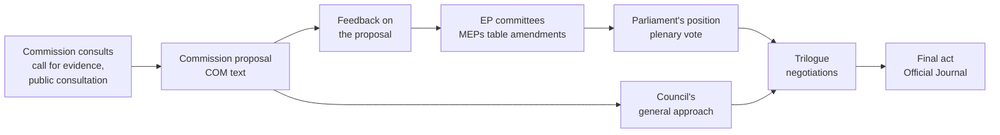
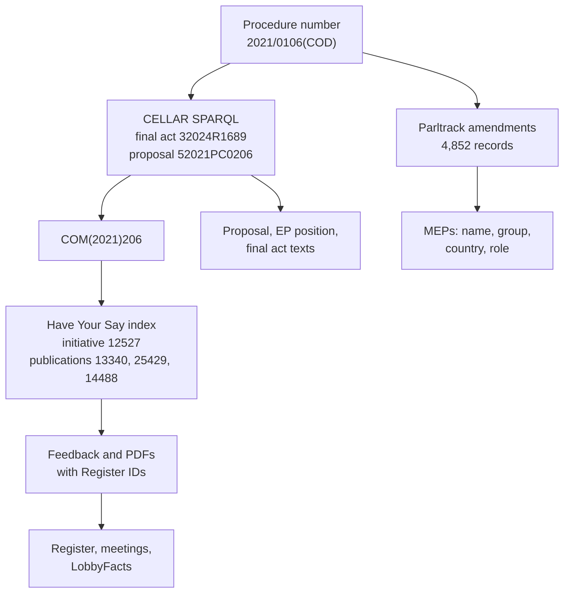

# Who Writes Europe's Laws?

**Influence Atlas Primer** · Reversa × Madrid Open · Challenge 03 · Saturday 3 October 2026

This page explains, from zero, the challenge the organizers handed out this morning, what
changed from the brief we prepared for, and how we intend to win it: the data, the
architecture, the matching method, the models, the strategy for each of the jury's checks
and the plan for the day.
It replaces the [first explainer](influence-graph-primer.md) as the team's reference.
That page's background on how an EU law is made, what amendments and lobbying are, and why
shared wording proves nothing still holds, and is summarised in §3.

Facts carry a tag:

- `verified`: we read the primary source today.
- `measured`: we computed it ourselves from public data, on the team laptop (Apple M5,
  10 cores, 24 GB) unless stated.
- `reported`: from a secondary source we could not open, or a search summary.
- `proposed`: our design choice, not yet agreed with the project owner.
- `assumed`: an estimate used for planning, not checked.

The research behind each section is in
[docs/research/influence-atlas-2026-10/](../research/influence-atlas-2026-10/), and the
record contracts and acceptance tests for each part are in the
[technical design](../design/influence-atlas-design.md). The
[consolidated plan](../plan.md) settles where this page, the design and the uploaded
[technical plan](../brief/PLAN.md) disagree on tools, thresholds and order.

## Contents

- [Start Here](#start-here)
- [1. What Changed This Morning](#1-what-changed-this-morning)
- [2. First Principles: The Score Decides What We Build](#2-first-principles-the-score-decides-what-we-build)
- [3. The Domain in Five Minutes](#3-the-domain-in-five-minutes)
- [4. What Survives, What Dies, What Is New](#4-what-survives-what-dies-what-is-new)
- [5. The Data](#5-the-data)
- [6. The Architecture](#6-the-architecture)
- [7. How We Find and Prove a Link](#7-how-we-find-and-prove-a-link)
- [8. Who Wins: Outcomes and Rankings](#8-who-wins-outcomes-and-rankings)
- [9. Explain and Forecast](#9-explain-and-forecast)
- [10. Models From Hugging Face](#10-models-from-hugging-face)
- [11. How We Win, Criterion by Criterion](#11-how-we-win-criterion-by-criterion)
- [12. Today's Plan](#12-todays-plan)
- [13. Decisions for the Owner](#13-decisions-for-the-owner)
- [Sources](#sources)

## Start Here

Until this morning, Challenge 03 was an exam. At 19:00 the organizers would publish 60
pairs, each an amendment and a lobby submission, and grade the score we gave each pair
against answers we would never see. The brief handed out at kickoff,
[The Influence Atlas](../brief/influence-atlas-challenge-brief.pdf), turns it into an
audit. Nobody hands us pairs. We must find, across all of EU law-making since 2019, which
organizations' requests ended up in amendments and in the final law, and show the
evidence. At 19:30 the jury reads three of our links at random, names a law on the spot,
and reads our report.

The core of our first idea survives: compare **the change an amendment makes** with **the
change a lobby paper asks for**, never the two whole documents, because whole documents
share quoted law and standard phrases. Around that core we now need a search stage (find
the candidate pairs ourselves), an outcome stage (did the request reach the final law?),
an identity stage (one name per organization), an analysis layer (who wins, how, what
next) and a written report.

If you have two minutes, read §2 and §12.

## 1. What Changed This Morning

### The Brief, Old and New

| | First brief (Influence Graph, pp. 12–15) | Atlas brief (12 pages) |
| --- | --- | --- |
| Question | Was this amendment written from this submission? | "Which companies and people actually get their way inside the laws, and who will next?" |
| Scope | The pairs they hand out | "All of Europe, from 2019 to today" |
| Inputs | 60 pairs and 20 proposals at 19:00 | None: "We hand out nothing: no dataset, no labels" |
| What we hand in | `pairs.csv`, `proposals.csv`, a demo | A graph the jury can explore live, a short public report, an open-source repository anyone can rerun |
| Scoring | 60 hidden test, 20 difficulty, 20 demo | 100 points, all checked live (below) |
| Day | Inputs 19:00, CSVs and demos 20:00 | Build from 09:30, live demos with jury checks 19:30, winners 21:00 |
| Rules | Public data; hand-labelling the test pairs disqualifies | Public data; public repository with an open licence; teams of 3–4; "Found a better angle on who shapes the world's laws? Take it." |

All `verified` from both PDFs (page-preserving `pypdf` extraction). The owner reported
that the organizers changed the task; the new PDF carries the same "Challenge 03" label.

### What the Jury Checks at 19:30

| Criterion | Points | What the jury does | What "great" looks like (brief, p. 9) |
| --- | ---: | --- | --- |
| Real links | 25 | Picks 3 links from our graph at random and reads both texts side by side | All three are real influence, not shared standard wording |
| Any law | 20 | Names an EU law on the spot; our system shows who shaped it, with no code changes | Results on screen in minutes, and they hold up |
| Insight | 25 | Reads our answers to the five questions | Something non-obvious they can check on the spot |
| Report | 15 | Reads our report and opens our repository | Publishable as it is, and anyone can rerun it |
| Ambition | 15 | How much of Europe we cover, and our forecast | Everything since 2019, with a reasoned view of what comes next |

The report must answer five questions (p. 5): **who** influences EU law most; on **what**
topics; pushing **towards** what, and does it match what they say in public; **how**,
through which channels (consultations, meetings, MEPs, coalitions, timing); and what
**next**, who is rising and what they will win. The brief names four layers to build
(p. 6): **map** (the graph), **rank** (who wins, by topic and year), **explain** (public
voice against private ask, and the playbook that wins), **forecast** (who rises and which
asks will land). Its bar for each (p. 8), weak against great:

| Piece | Weak | Great |
| --- | --- | --- |
| The graph | Organizations linked because they share words | Every edge shows its evidence: the ask, the amendment, the final article |
| Who wins | The biggest spenders, which the register already tells you | Who actually gets their way, even when it is not who spends most |
| Towards what, and how | A list of topics | The positions each actor pushes and the playbook that works for them |
| The next years | A chart of the past | Who is rising, on what, and what they will win next, with reasons |
| The report | A dashboard only your team can read | A report a journalist could publish tomorrow |

### What Changed in the Repository Since We Started

When this re-planning began, `main` was at `1142700`. Five pull requests have merged since
(`verified` with `gh`):

| PR | What it did | Under the Atlas brief |
| --- | --- | --- |
| [#16](https://github.com/lensabillion/reversa-madrid-open/pull/16) | The architecture skill: every feature is fitted into the agreed design before it is built | Kept; rewritten for the Atlas architecture in this change |
| [#17](https://github.com/lensabillion/reversa-madrid-open/pull/17) | Removed the network tab, which drew a graph from LobbyPlag's 2013 labels | Still right: our graph is built from our own links |
| [#18](https://github.com/lensabillion/reversa-madrid-open/pull/18) | Removed research code no part used (the Qwen experiment runtime, challenge-choice scripts) | Neutral; results kept, code in git history |
| [#19](https://github.com/lensabillion/reversa-madrid-open/pull/19) | `make submit`: validated `pairs.csv` with evidence, 60 pairs in 0.16 s | No CSV deliverable now; its validation and comparison path is reused by part 4 |
| [#20](https://github.com/lensabillion/reversa-madrid-open/pull/20) | The practice harness on LobbyPlag: precision in the top 20 0.980, recall 0.814, AUC 0.863; per-fold AUC 0.655–0.987 | Becomes the out-of-period precision check for part 4 |

The beads were updated to match (tbd, `rev-sz6q`):

- the five beads of those PRs were closed with their merge evidence, and so were four
  beads the merges had already settled (`rev-0pmq`, `rev-ma0a`, `rev-aekp`, `rev-p2rd`);
- the CSV-specific beads (`rev-fkut`, `rev-e5xh`) were closed as superseded;
- eleven open beads were retargeted to the new parts or annotated with what changes for
  them;
- twelve new beads cover the new parts, linked in pipeline order (§12 lists them).

A concurrent session wrote the
[technical design](../design/influence-atlas-design.md) (`rev-f090`) for the same eight
parts.

## 2. First Principles: The Score Decides What We Build

A competition is a measuring instrument. Whatever it measures is what a team should
build, so the first question is always: what exactly is measured, and how?

**The first brief was an exam.** Someone else had done the hardest part, choosing which
amendment to compare with which submission. We only judged each pair, and the judgement
was graded against an answer key: 30 real pairs, 30 decoys, scored by precision in our top
20 and recall on the 30 real ones. That hidden test, with 20 adoption predictions, was
worth 60% of the event, and most of it rested on one function: *pair → score*.

**The Atlas brief is an audit.** There is no answer key. The jury samples our own output
and checks it by reading. Four consequences follow, and the whole design comes from them.

### Consequence 1: We Must Find the Pairs Ourselves

Nobody tells us which submission to compare with which amendment. Take one law, the AI
Act (procedure `2021/0106(COD)`):

- Parliament's committees tabled 4,852 amendments to it (`measured`, Parltrack dump).
- The Commission received 304 feedback items on the proposal (`verified`, Have Your Say)
  and 1,216 replies to the earlier White Paper consultation (`verified`).
- A position paper splits into, say, 30 passages (`assumed`), so the 304 items give about
  9,000 passages.

Every amendment against every passage is 4,852 × 9,000 ≈ **44 million comparisons** for
one law. A careful judge that reads 50 pairs per second (`assumed`) would need ten days.
So we need a **funnel**: a cheap, fast search that keeps everything plausible (part 3),
then the careful judge on the shortlist only (part 4). The cheap stage is fast enough:
exact search of 2,000 × 60,000 vectors takes 0.9 s on the laptop (`measured`), and a
multilingual encoder reads about 225 texts a second (`measured`), so one law's index costs
about a minute to build.

### Consequence 2: Precision of What We Show Beats Recall

The jury picks three links at random. If a fraction *p* of the links we show are real,
the chance that all three hold up is *p*³ (`measured` arithmetic):

| Share of shown links that are real | Chance all 3 pass |
| ---: | ---: |
| 99% | 0.97 |
| 95% | 0.86 |
| 90% | 0.73 |
| 80% | 0.51 |
| 70% | 0.34 |

A graph that is 90% right fails one of the three checks in more than a quarter of demos.
So we **show only the links we would defend**, and keep weaker candidates out of the graph
the jury samples, labelled "unconfirmed" in a separate view (`proposed`). Coverage, which
ambition rewards, comes from the number of laws and the amendment layer, never from
loosening the threshold.

### Consequence 3: The System Must Be General and Fast, Live

"We name an EU law on the spot. Your system shows who shaped it, with no code changes.
Results on screen in minutes." So every part takes a procedure number and nothing
law-specific: no per-law code, configuration or hand-picked documents. We precompute as
many laws as we can during the day, and keep an on-demand path, timed, for a law we did
not precompute.

### Consequence 4: Words Are a Deliverable

Insight and report are 40 points, judged by reading. The analysis must end in claims a
journalist could print and a juror could check in 30 seconds: a number, a named actor or
law, and one click to the evidence.

### Where the Points Come From

| Points | Criterion | Carried by (parts, §6) |
| ---: | --- | --- |
| 25 | Real links | 3 find candidates, 4 verify links, 8 evidence card |
| 20 | Any law | 1 collect, every part generic, 8 any-law command |
| 25 | Insight | 5 outcomes, 6 graph, 7 analyse |
| 15 | Report | 7 analyse, 8 report and open repository |
| 15 | Ambition | batch over all laws, 7 forecast |

Forty-five points rest on one command that turns a procedure number into verified links
with their evidence. That path comes first.

## 3. The Domain in Five Minutes

The [first explainer](influence-graph-primer.md#1-how-an-eu-law-is-made) tells this
story in detail; here is what the Atlas needs.

### How an EU Law Is Made

Most EU laws follow the **ordinary legislative procedure**, whose files carry a number
such as `2021/0106(COD)`: the year, a sequence number, and `COD` for "codecision".
Files ending `(INI)` are Parliament's own-initiative reports, which are not laws.



- The **Commission** consults (anyone may answer, on the *Have Your Say* portal), then
  writes the **proposal**, and collects feedback on it.
- In the **European Parliament**, a lead committee appoints a **rapporteur** (who writes
  the report) and each political group a **shadow rapporteur**. Members (MEPs) **table
  amendments**: each says "replace this text of the proposal with that text". The AI Act
  drew 4,852 of them (`measured`).
- The committee votes, often merging many amendments into **compromise amendments**, and
  the plenary adopts **Parliament's position**.
- The **Council** (the member states' governments) adopts its own position, the
  **general approach**.
- Parliament, Council and Commission negotiate in **trilogues**, often on a
  **four-column document**: proposal | Parliament | Council | compromise.
- The agreed text becomes the **final act**, published in the Official Journal and
  identified by a **CELEX number** such as `32024R1689` (the AI Act).

### Who Tries to Shape It

A **lobby** is any company, association or NGO that tries to shape a law. The EU's
**Transparency Register** lists organizations that lobby the institutions, with an ID, a
category (company, trade association, NGO, consultancy), declared spending and staff.
Their consultation answers are public, and so are the meetings declared by Commissioners
and their cabinets, and by MEPs who are rapporteurs, shadows or committee chairs.

An **ask** is one concrete change an actor requests: "in Article 10(3), qualify
'representative' with 'sufficiently'". A position paper can hold dozens of asks, sometimes
written as ready-made amendments.

### How Far an Ask Gets

| Level | Meaning |
| --- | --- |
| **Heard** | An MEP tabled an amendment that echoes the ask |
| **Adopted by Parliament** | The echoed change is in Parliament's position |
| **Won** | The change is in the final act |

Two more paths matter for "who wins". An ask can be **in the proposal already** (the
actor was early, or the Commission agreed), and an ask can be **won through the Council**
with no Parliament amendment at all. Tabling lobby wording is legal and common; the atlas
shows text reuse and outcomes, not wrongdoing.

### The Trap: Shared Wording Proves Nothing

An amendment is the proposal's text with a change in it. A lobby paper about the same
article usually quotes the same proposal text. So any two documents about one article
share most of their words, whoever wrote them. And legal prose repeats standard phrases
("Member States shall ensure that", "without prejudice to"). Similar wording is the
weakest evidence there is. The evidence is in **the change**: the words the amendment
inserts or deletes, and whether the lobby paper asked for that same change, in the same
direction, before the amendment was tabled. LobbyPlag already compared insertions with
insertions in 2013 (bead `rev-znsr` corrects our first explainer on this); what it lacked
was a test for rarity, direction, paraphrase and timing.

## 4. What Survives, What Dies, What Is New

| | Item | What happens |
| --- | --- | --- |
| Survives | Compare the change, not the document | The core of part 4, and now the brief's own trap |
| Survives | Signals: rare shared phrases, alignment, same edit same direction, legal polarity, meaning of the changes | Part 4, unchanged in purpose |
| Survives | Heard ≠ won | Part 5; it answers "who actually gets their way" |
| Survives | The three-column evidence view | Part 8: the card the jury reads in the real-links check |
| Survives | The practice harness and LobbyPlag labels | The out-of-period precision check (practice loop) |
| Survives | The rules: our own links only, raw output apart from labels, parts that run without the server | §6 design rules |
| Dies | `pairs.csv`, `proposals.csv`, the 19:00 rehearsal | No CSV deliverable |
| Dies | Calibrating for a 50/50 test, the recall threshold, AUC on 20 proposals | No answer key |
| Changes | LobbyPlag: from training set and test proxy to an out-of-period check | It is GDPR, 2013, outside the 2019 scope |
| Changes | Adoption model → forecast with reasons, tested on later laws | Nobody grades it for us; we must show it is credible |
| Changes | "No hand labelling" → nobody edits results; sampled audits measure precision | The disqualification rule is gone; measurement is now our job |
| New | Find candidates (search) | Part 3 |
| New | Resolve actors (one identity per organization) | Part 2 |
| New | Trace every link to the final article | Part 5, now core |
| New | Rank, explain (channels, public voice), forecast | Part 7 |
| New | Public report, open licence, public repository | Part 8 |

## 5. The Data

No data is handed out; finding it is part of the challenge. Everything below is public.
Unless tagged otherwise, each route was requested live on 3 October between 10:40 and
11:10 (`verified`; full detail in the
[data-sources report](../research/influence-atlas-2026-10/data-sources.md)).

### What Is Already on the Laptop

| Data | Contents | Status |
| --- | --- | --- |
| Parltrack committee amendments (`data/parltrack/ep_amendments.json.zst`) | 1,272,091 amendments; 542,314 dated 2019–2026 under 1,589 procedure references; old and new text, authors, MEP IDs, committee, date. Read in 6 s | `measured` |
| Parltrack plenary amendments | 7 MB compressed | on disk |
| LobbyPlag (GDPR 2012–13) | 172 verified copies, 100 weak negatives: the practice set | on disk |
| One final act (GDPR) and one sample consultation PDF | Samples only | on disk |

The consultation papers, proposals, Parliament positions and final acts for 2019–2026 are
**not downloaded yet**. That is the first schedule risk, and the first job (§12).

### The Sources and How They Join

| Source | What it gives | Route | Join key | Licence | Caveats |
| --- | --- | --- | --- | --- | --- |
| **Have Your Say** (Commission) | Every initiative's stages, and every feedback item: organization, type, country, size, text, attachments, Register ID | `brpapi/groupInitiatives/{id}`; `api/allFeedback?publicationId=…&page=k&size=100`; `api/download/{documentId}` (PDF) | COM reference, e.g. `COM(2021)206`; `trNumber` = Register ID | Commission reuse policy (`reported`) | **No procedure-number field and no search by COM number**: crawl the 4,128 initiatives once into an index. Some public-consultation questionnaires are not served by the API (AI White Paper: `bad_request`; DSA: works). Some are campaign-inflated (CSDDD: 473,461 responses) |
| **Parltrack** dumps | Committee and plenary amendments; dossiers (the Legislative Observatory mirrored) with subject codes and the final act's CELEX in a URL; MEPs; votes | `parltrack.org/dumps/*.json.zst`, one record per line | Procedure reference; MEP IDs | ODbL 1.0 | **Committee amendments stop on 3 February 2026, other dumps on 24 July 2026.** Later files need the EP API. Per-dossier pages refuse scripts. No adopted/rejected field: adoption is inferred from text |
| **CELLAR** (Publications Office, behind EUR-Lex) | Procedure → final act and proposal in one SPARQL query; texts by CELEX in XHTML | `publications.europa.eu/webapi/rdf/sparql`; `http://publications.europa.eu/resource/celex/{CELEX}` with `Accept: application/xhtml+xml` | CELEX; procedure URI `procedure/2021_106` | Commission reuse policy (`reported`) | The EUR-Lex website returns an empty bot-wall page to scripts: always use CELLAR. A proposal returns a list of files: follow `DOC_1` |
| **EP Open Data API v2** | Procedures with events and documents; adopted texts (Parliament's positions) with EuroVoc topics; MEPs | `data.europarl.europa.eu/api/v2/procedures/2021-0106` | Procedure; document IDs such as `TA-9-2023-0236` | not checked | No CELEX and no committee amendments; the fallback after Parltrack's dumps stop |
| **HowTheyVote.eu** | 25,204 plenary roll-call votes since July 2019, including amendment-level results (30 for the AI Act), MEP positions, subject codes | Weekly CSV release on GitHub | Procedure reference, amendment number | ODbL | Roll-call votes only: no committee votes, no show-of-hands |
| **Transparency Register** | 17,897 organizations: ID, name, category, country, declared costs and budget, members, the files they follow, association memberships | Daily XML export (117 MB); dated snapshots since 2016 on data.europa.eu | Register ID | open data | No meetings |
| **Commission meetings** | Meetings of Commissioners and cabinets with organizations: date, subject, Register ID | Official XLSX per Commission (2019–24, 2024–29) | Register ID | open data | Short free-text subject, no procedure number: match by subject words and dates |
| **Integrity Watch EU** (Transparency International EU) | Commission meetings and MEP meetings (terms 9 and 10, rapporteurs and shadows), a name-to-Register-ID file, costs and meeting counts per organization | Nightly JSON and CSV | Register ID; MEP ID | not stated | The MEP `dossier` field is often empty |
| **LobbyFacts.eu** | Each organization's register history since 2012 and its Commission meetings | One CSV per Register ID | Register ID | not stated | One request per organization; fine for a few hundred |
| GDELT (news) | Article lists | DOC 2.0 API | — | — | Rate-limited (HTTP 429) from this network; about three months of coverage: skip |
| US lobbying disclosures | Filings by client | `lda.gov/api/v1/` | names only | — | HTTP 403 from this network: skip today |
| Council | — | — | — | — | No structured feed of lobby meetings: skip |

### From a Procedure Number to Everything Else



1. **Final act and proposal**: normalize `2021/0106(COD)` to `procedure/2021_106`; one
   SPARQL query returns `32024R1689` and `52021PC0206` (`verified` for the AI Act, DSA,
   CSDDD and a fourth law); fetch both texts from CELLAR.
2. **Consultation**: `52021PC0206` ↔ `COM(2021)206` (drop the zero padding); look it up in
   the Have Your Say index; page through each publication's feedback; download the
   attachments.
3. **Amendments**: filter Parltrack by procedure reference; join MEP IDs to the MEP dump;
   for files after February 2026, the EP API.
4. **Actors**: the Register ID from the feedback item, else a normalized-name match against
   the register export; budget and category from the register; history and meetings from
   LobbyFacts and Integrity Watch, filtered to the law's dates and subject words.
5. **Topics and years**: subject codes from the dossier, dates from each record.

### Labels: What Exists to Check Ourselves Against

There is **no public 2019+ set of lobby → amendment copies** (`verified` by search). What we
have instead:

| Label source | What it labels | Period |
| --- | --- | --- |
| LobbyPlag | Lobby → amendment copies | GDPR, 2012–13 |
| War of Words II (Zenodo, CC BY 4.0) | About 240,000 committee amendments marked accepted or not | 2009–2019 |
| HowTheyVote | Plenary amendment adopted or rejected (roll calls) | 2019–2026 |
| Integrity Watch MEP meetings | Weak corroboration: the organization met the MEP who tabled the amendment, before it was tabled | 2019–2026 |
| Our blind audit | Precision of our own published links | today |

A further public repository, a master's-thesis pipeline (`maxpieter/EU_LOBBYING_INFLUENCE`),
pairs real amendments with named consultation feedback for nine 2020–2025 procedures with
language-model labels; it has no licence, so it can inform us but not be redistributed
(`verified`, [datasets catalog](../research/influence-2026-10/datasets.yaml)).

### Candidate Laws for the First Vertical Slice

| Law | Procedure | Final act | Have Your Say | Committee amendments |
| --- | --- | --- | --- | --- |
| **AI Act** | 2021/0106(COD) | 32024R1689 | initiative 12527; 304 feedback items on the proposal, 187 with a Register ID, 259 with attachments | 4,852 |
| Digital Services Act | 2020/0361(COD) | 32022R2065 | initiative 12417; 138 on the proposal plus 2,863 consultation replies through the API | 5,901 |
| Corporate sustainability due diligence (CSDDD) | 2022/0051(COD) | 32024L1760 | initiative 12548; 288 on the proposal | 5,934 |
| Digital Markets Act | 2020/0374(COD) | — | initiative 12418; 90 on the proposal | 3,261 |

Start with the AI Act: the richest proposal-stage feedback with Register IDs, press
interest, and 30 amendment votes in HowTheyVote. The DSA is second.

### Data Rules

- Every record keeps its URL, retrieval time and SHA-256; the report's source appendix
  lists them.
- Quote short evidence spans and link to the originals; do not redistribute whole
  consultation PDFs.
- A database derived from Parltrack or HowTheyVote stays ODbL with attribution.
- Individual citizens' submissions (`EU_CITIZEN`) are counted, never named.

## 6. The Architecture

Eight parts plus a practice loop (`proposed`). Each part has one job and hands a defined
output to the next, so three or four people can build in parallel. The
[architecture skill](../../.agents/skills/influence-architecture/SKILL.md) checks every
feature against this section; the [technical design](../design/influence-atlas-design.md)
gives each part's record contracts and completion tests.

```mermaid
flowchart LR
  query["Law name or<br/>procedure number"]
  collect["1 · Collect<br/>amendments, submissions,<br/>proposal, EP position,<br/>final act, register,<br/>meetings, votes"]
  actors["2 · Resolve actors<br/>one ID per organization<br/>and MEP"]
  find["3 · Find candidates<br/>per-law index,<br/>shortlist per amendment"]
  verify["4 · Verify links<br/>signals, judge,<br/>threshold, evidence"]
  trace["5 · Trace outcomes<br/>heard, adopted<br/>by Parliament, won"]
  graph["6 · Atlas graph<br/>every edge with<br/>its evidence"]
  analyse["7 · Analyse<br/>rank, explain,<br/>forecast"]
  publish["8 · Publish<br/>explorer, any-law command,<br/>report, open repository"]
  practice["Practice loop<br/>LobbyPlag, blind audit,<br/>time-split backtest"]
  query --> collect --> actors --> find --> verify --> trace --> graph --> analyse --> publish
  collect --> trace
  graph --> publish
  practice -->|threshold| verify
  practice -->|backtest| analyse
  classDef io fill:#ffe17a,stroke:#8a5800,color:#2e2400
  classDef out fill:#e7eaf7,stroke:#2a3c9a,color:#161a2c
  class query io
  class graph,publish out
```

The arrows: a procedure number goes through parts 1 to 6 in order. Part 3 reads part 1's
records and part 2's identities; part 5 reads part 1's final texts and part 4's links.
Parts 6 and 7 feed part 8. The practice loop feeds parts 4 and 7. The live any-law check
runs parts 1 to 6 for one procedure and shows it in part 8.

### Part 1 · Collect

- **Job.** Given a procedure number, download and normalize its public record: committee
  and plenary amendments, consultation and feedback submissions with their attachments,
  the Commission proposal, Parliament's position, the final act, the register entries of
  the organizations involved, meetings, and votes.
- **How.** One connector per *source family*, never per law (§5 lists them). PDFs to text
  with the existing extraction service (`pypdf`), split into passages of one to three
  sentences that overlap their neighbours. For each amendment, extract the **change**
  from its old and new text: inserted and deleted words, with one sentence of context.
  Detect each document's language. Every record keeps its source URL, retrieval time and
  SHA-256 hash. Downloads are cached under `data/laws/<procedure>/`, resumable, with
  bounded retries.
- **Hands on.** Normalized records with provenance.
- **Builds on.** `services/documents.py` (PDF extraction), the `repositories/` pattern.
- **Beads.** `rev-pjk2`; `rev-xltz` (does extraction keep the evidence on real papers?).

### Part 2 · Resolve Actors

- **Job.** One identity per organization and per MEP across all sources.
- **How.** The Transparency Register ID first, where a source carries it; then the
  normalized name (case, accents, legal-form suffixes such as GmbH, SA, aisbl, acronyms in
  brackets); then fuzzy matching (RapidFuzz) only within the same country and register
  category, as a candidate. Never merge two different register IDs, never merge an
  association with its members (BusinessEurope is not Siemens), never merge on an acronym
  alone. MEPs are keyed by their Parliament ID. Private citizens are aggregated, never
  named.
- **Hands on.** An actor table and an alias table, every alias with its source.
- **Bead.** `rev-1vxz`.

### Part 3 · Find Candidates

- **Job.** For each amendment, a short list of submission passages it could come from.
  High recall, cheap.
- **How.** Per law, in memory. Two retrievers, merged:
  1. **Lexical**: BM25 (a standard ranking of documents by shared rare words) over
     passages, the query being the change's words weighted by their rarity.
  2. **Dense**: a multilingual embedding model turns each change and each passage into a
     vector; similar meanings get nearby vectors, across languages; one matrix product
     ranks all passages.

  Take the top 20 from each and merge them by reciprocal rank fusion (each candidate
  scores the sum of 1/(60 + its rank) across the two lists). A passage that names the
  article the amendment edits gets a small boost.
- **Also here.** **Coordinated amendments**: near-identical changes tabled by MEPs of
  different political groups on one law point to a shared outside draft (`rev-637f`).
  They need only the amendments already on disk.
- **Complexity.** Building the index is linear in the number of passages; the exact
  search is one product of a (changes × dimensions) and a (dimensions × passages)
  matrix: 0.9 s for 2,000 × 60,000 (`measured`). No vector database.
- **Hands on.** Candidate pairs with both retrieval ranks.
- **Beads.** `rev-aapn`, `rev-00x6`, `rev-637f`.

### Part 4 · Verify Links

- **Job.** The careful judge, run only on candidates. Decide whether the amendment's change
  really carries the ask, keep the evidence, and publish only what clears the threshold.
- **How.** §7 explains the method. In short: mask quoted law and standard phrases, compute
  the signals, let a judge read the change against the passage on the top candidates
  only, veto contradictions, combine into one score, and apply the date gate (the ask
  must predate the amendment).
- **Hands on.** Each link with its score, every signal, the evidence spans with character
  offsets, and a status: published, unconfirmed or contradicted.
- **Builds on.** The comparison service on `main` (`lexical-delta-v1`), the submission
  command's validation path.
- **Beads.** `rev-nuk5`, `rev-zzur` (threshold), `rev-sbrp` (legal polarity), `rev-jaig`
  (D1, the judge).

### Part 5 · Trace Outcomes

- **Job.** For each ask and amendment: heard, adopted by Parliament, won, with the final
  article's text as evidence.
- **How.** §8. Align the articles of the proposal, Parliament's position and the final
  act; test whether each change survives.
- **Hands on.** An outcome per ask and amendment, with spans in the later texts.
- **Bead.** `rev-uhpq`. Owner rule of 3 October: adopted means the requested wording
  survives in the final law, labelled automatically.

### Part 6 · Atlas Graph

- **Job.** The single store that the explorer, rankings and report read.
- **Shape.** Nodes: actors, asks, amendments, articles (proposal, Parliament, final), MEPs,
  topics, procedures. Edges: actor *requested* ask; ask *echoed by* amendment (our link,
  with its evidence); amendment *tabled by* MEP; amendment *edits* article; article
  *became* final article; ask *won in* final article; plus dated context edges for
  meetings and votes. A meeting never proves an ask was passed on; it is context.
- **How.** Plain JSON Lines files per law and one merged index; NetworkX for analysis;
  SQLite only if the cross-law joins need it. Built from part 4's published links and
  part 5's outcomes, never from LobbyPlag's labels.
- **Bead.** `rev-i006`.

### Part 7 · Analyse

- **Rank** (`rev-5yy6`): who wins, by actor, actor type, topic and year, compared with
  lobby spend (§8).
- **Explain** (`rev-rg6l`): the positions each actor pushes, its channels, and its public
  statements against its asks (§9).
- **Forecast** (`rev-104q`): who is rising, and which open asks will land, tested on laws
  decided after the training laws (§9).

Every ranking row, finding and forecast links to the edges behind it.

### Part 8 · Publish

- **The explorer**: a law page (actors, links, coverage of each layer), an actor page, and
  the **evidence card**: ask | amendment change | final article, matched words
  highlighted, quoted law greyed out, dates and rarity shown. It extends the existing
  three-column workspace.
- **The any-law command**: `influence atlas <name or procedure number>` runs parts 1 to 6
  for one law (from cache when precomputed) and opens its page (`rev-qn6b`).
- **The batch**: the same command over every 2019+ procedure, resumable (`rev-0who`).
- **The report** (`rev-fod0`) and the **open repository** (`rev-nzqr`, `rev-p61s`).

### Practice Loop

- **LobbyPlag** (GDPR, 2013, 172 verified copies and 100 weak negatives): sets and checks
  part 4's threshold out of period. It overstates precision on paraphrase, so we report it
  as an upper reference.
- **Blind audit** (`rev-sn3u`): a random sample of our own published 2019+ links, read by
  two people without the score; precision with a Wilson interval (§7).
- **Backtest** for the forecast: train on laws concluded before a cutoff, test on later
  ones.

### Design Rules

- **Every edge carries its evidence**: the ask's passage, the amendment's change and, when
  it won, the final article, with source URLs and character offsets.
- **Show only what we would defend.** The graph shows published links only; unconfirmed
  candidates live in a separate, labelled view and never enter rankings.
- **Any law, no code changes.** Every part takes a procedure number and nothing
  law-specific.
- **Raw model output stays separate from labels.** Every score is saved with the signals
  that produced it. Audit and LobbyPlag labels measure; they never become edges.
- **An optional part may fail without stopping the run**, and the run says what is
  missing. A missing required input stops with a clear error.
- **Nobody edits links, scores or rankings by hand.** People may audit a random sample.
- **Anyone can rerun it.** Downloads are scripted, pinned and cached; model revisions
  pinned; a fresh checkout rebuilds the same results.

### Rejected Designs

| Option | Why not |
| --- | --- |
| A graph from historical labels (LobbyPlag's verified flags) | It shows someone else's analysis, from 2013 |
| Whole-document similarity | Decoys score higher than real copies on GDPR: 0.84 against 0.78 (`measured`, first explainer §8) |
| A reranker score as the verdict | It rewards topic overlap, the decoys' trick; it gave contradictory submissions high scores (`measured`, PR #14) |
| A spending leaderboard | The brief calls it weak: the register already tells you |
| One-law hard coding | Fails the any-law check |
| A vector or graph database | No gain at 10⁴–10⁵ vectors per law; more to run |
| Training a large model | No labels, no time; a working evidence path first |

## 7. How We Find and Prove a Link

This is where 25 points are won or lost, so here is the method end to end, with an
illustration. *The texts below are made up to show the mechanics; they are not a
finding.*

> **Commission proposal**: Training data sets shall be relevant, representative, free of
> errors and complete.
>
> **Amendment**: Training data sets shall be relevant, **sufficiently** representative
> and, **to the best extent possible**, free of errors and complete **in view of the
> intended purpose**.
>
> **Lobby passage A**: Perfect data does not exist. We propose requiring datasets that are
> "sufficiently representative" and error-free "to the best extent possible".
>
> **Lobby passage B**: Article 10 provides that training data sets shall be relevant,
> representative, free of errors and complete, and we support the requirement as
> proposed.

Passage B shares 13 distinct words with the amendment; passage A shares 10. Word overlap
says B. The method says A.

### Step 1: Extract the Change

The amendment's change is what it adds or removes relative to the proposal: insert
"sufficiently", "to the best extent possible", "in view of the intended purpose". The
other words are the Commission's, and are no evidence of anything.

### Step 2: Mask Quoted Law and Standard Phrases

- Remove from the lobby passage every span of eight or more words that appears in the
  proposal: lobby papers quote it. Passage B is now "Article 10 provides that …, and we
  support the requirement as proposed": nothing left to match. Passage A keeps
  "sufficiently representative" and "to the best extent possible", both inside the
  amendment's change.
- Down-weight phrases common across the corpus: count, for every 3-, 4- and 5-word phrase,
  in how many of the 2019+ amendments and submissions it appears, and by how many distinct
  authors. "Member States shall ensure that" appears everywhere and weighs almost nothing.
- Do not discard a paragraph that many *different* organizations submitted on the same
  law: that is a coordinated campaign, real influence. Attribute it to the coalition.

### Step 3: Signals

| Signal | What it catches | What fools it |
| --- | --- | --- |
| Rare shared phrases inside the change, weighted by corpus rarity | Verbatim and near-verbatim reuse | Paraphrase |
| Local alignment (Smith-Waterman on words) | Copies with edits and reordering | Paraphrase |
| Same edit, same direction | Insert against delete; stricter against looser; changed numbers (24 → 72 hours) | Nothing alone; it is a filter |
| Legal polarity: shall / may / shall not / may not, negation, quantities | Opposite requests on the same article | Complex sentences |
| Meaning similarity of change and passage (multilingual embeddings) | Paraphrase and other languages | Topic overlap: same article, different request |
| Entailment (NLI): does the passage request what the change does? | Contradiction and opposite requests | Long passages |
| Judge (optional, D1): reads only the change and the passage | Paraphrase, intent, direction; returns exact quotes | Must be checked: every quote is verified as an exact substring, or dropped |
| Date gate | A paper reacting to the amendment, not causing it | Undated documents (treated as ineligible, never as passing) |
| Coordination | The same change tabled by MEPs of different groups | Group-internal templates |

The combiner is a logistic regression over the signals, fitted on LobbyPlag's labelled
pairs with organization-grouped folds (the practice harness), so each weight can be
explained in the demo.

### Step 4: Tiers and the Threshold

| Tier | Rule (`proposed`) | Shown by default |
| --- | --- | --- |
| Copied | A rare phrase of 6–8+ words inside the change, same direction, date gate passed | Yes |
| Reworded | The meaning signals and the judge say same request with high confidence, some rare-word overlap, same direction, date gate, no contradiction veto | Yes, if its audited precision clears the bar; otherwise behind a labelled toggle |
| Same direction only | Same article, same direction, no specific evidence | No: unconfirmed view |

The brief says real influence "is usually reworded, and that is what we want you to
catch", so the reworded tier matters; but it enters the graph only on audited evidence.

### Step 5: The Evidence Card

Each published link opens one card: the ask (organization, document, page, date, link to
the original), the amendment (number, MEPs, committee, date, link), the final article
(number, link, or "not in the final law: heard, not won"). Matched words are highlighted,
quoted law greyed out, and one line answers the boilerplate objection before the jury
raises it: "this 6-word phrase appears in N of 542,314 amendments since 2019".

### Step 6: Measuring Precision Without an Answer Key

We cannot know the precision of 2019+ links without reading some, so we read a sample,
properly:

1. Draw links uniformly at random from the published graph, with a printed seed,
   stratified by law and tier.
2. Two people read each one without seeing its score and mark: real influence, standard
   wording, or unrelated or opposite.
3. Report the precision with a **Wilson 95% interval**, the standard interval for a
   proportion from a small sample (`measured` arithmetic):

| Correct / read | Wilson 95% interval |
| --- | --- |
| 19 / 20 | 0.76 – 0.99 |
| 30 / 30 | 0.89 – 1.00 |
| 38 / 40 | 0.84 – 0.99 |
| 57 / 60 | 0.86 – 0.98 |

Thirty links read and all correct is the minimum to claim "at least 0.89" with 95%
confidence. Plan 40: two people, about 45 minutes (`assumed`). The labels are stored apart
from model output and never edit the graph; if precision is short, the threshold moves,
for every link alike.

## 8. Who Wins: Outcomes and Rankings

### Did the Ask Survive?

For each procedure we need four texts: the Commission proposal, Parliament's position, the
Council's general approach when public, and the final act.

1. **Align provisions**, not just article numbers: articles get renumbered. Match by
   number first, then each paragraph to its most similar counterpart.
2. **Test each change** against the aligned paragraph:
   - *Won, verbatim*: the change's inserted rare words are found by alignment in the
     final paragraph, and its deleted words are gone.
   - *Won, in substance*: the same, through the meaning signals and the judge.
   - *Won, deletion*: a deletion request, and the deleted text is absent from the final
     act though present in the proposal.
   - *Not won*: none of these. *Unknown*: the text is missing or the file is still open.
3. Test against Parliament's position first ("adopted by Parliament"), then the final act
   ("won").
4. **Separate "changed the text" from "defended the status quo".** An ask already met by
   the proposal is a status-quo win; mixing the two flatters defenders. Research on EU
   lobbying finds that defending the status quo succeeds more often (Bunea 2013,
   `reported`).

At institution level, the word-origin method of Laloux & Delreux (278 trilogue acts,
2012–2018, `verified` draft) splits a final act's words into: from the proposal, from
Parliament, from the Council, from both, or new in trilogue. About 30 lines of code, and a
good chart for "who wins" between institutions. Text reuse between proposal and outcome is
an established method (Cross & Hermansson 2017; Haag 2022, `reported` and `verified`
abstract).

### Ranking Actors

- **Rates with their counts.** For each actor: asks made, asks heard, adopted by
  Parliament, won. Show "4 of 37", never "11%" alone.
- **Shrink small numbers.** A beta-binomial prior over all actors keeps "1 of 1" from
  topping the table.
- **Wins against spend.** Fit won asks against log declared lobby spend (Transparency
  Register) and rank by the residual: the actors that win more than their budget
  predicts, and the big spenders that win little. That is the brief's "great": who gets
  their way "even when it is not who spends most".
- **By topic and year.** Topics come from the procedure's subject codes in the Legislative
  Observatory and its EuroVoc descriptors in EUR-Lex: no classifier needed (§9).
- **Deduplicate.** A repeated filing is one ask; a win is not multiplied by the number of
  MEPs who tabled it; coalition asks keep joint attribution.
- **Within observed coverage.** Every ranking states which laws and layers it covers.

## 9. Explain and Forecast

### Topics

Read them, do not predict them: every procedure in the Legislative Observatory carries
subject codes (`verified`), and EUR-Lex attaches EuroVoc descriptors to acts (`reported`).
Submissions and amendments inherit their procedure's topics. Only if per-article topics
are needed: a zero-shot pass over about 20 top-level subjects.

### Channels: How Influence Travels

- **Consultations**: which stage the ask came in (call for evidence, public consultation,
  feedback on the proposal). Early asks may shape the proposal itself.
- **Meetings**: Commission meetings with organizations (with register IDs) and MEP
  meetings (rapporteurs and shadows), with dates.
- **MEPs**: who tabled the echoing amendments, from which groups; coordinated amendments
  across groups.
- **Coalitions**: several organizations making the same ask. EU lobbying research finds
  that issue-specific coalitions, more than single groups, decide success (Klüver 2013,
  `reported`).
- **Timing**: ask date against proposal, committee vote and trilogue dates.

We report "associated with observed wins", never "caused".

### Public Voice Against Ask

The brief's "what each actor says in public versus what it asks". For 5 to 10 actors with
strong links, we take 2 to 5 public statements on the same law (press releases, position
pages, op-eds), extract claims with exact quotes, and compare each with the actor's asks
on the same provision, on InfluenceMap's −2 to +2 scale (from "stricter" to "weaker or
delay"; their method separates what a company says from how it lobbies, `verified` in
part). A flag such as "supports the objectives in public, asks to delete Article 6" is
shown only with both quotes, and a person checks every flag shown. Automatic stance
detection on corporate policy text is still far from reliable (Morio & Manning 2023,
`reported`), so this layer is a labelled sample, not a census. Consultation submissions
are public, so we compare public messaging with published lobbying requests; we claim no
access to private communications.

### Forecast: Who Rises, and Which Asks Land

- **Which open asks land.** A logistic regression over features knowable before the
  outcome: direction (change or status quo), coalition breadth and counter-coalition,
  whether a matching amendment was tabled, whether the rapporteur's draft report contains
  it, whether the Council's general approach does, actor type, past win rate in the topic,
  meetings before the outcome. Baselines: the base rate, and the rule "the rapporteur's
  draft includes it".
- **Honest test.** Train on procedures concluded before a cutoff (for example 1 January
  2023), test on those concluded after, never splitting a procedure; build every feature
  from documents dated before the forecast date; report AUC and Brier score against the
  baselines. Open 2024–2026 files are right-censored: use "reached Parliament's position"
  as an interim outcome or leave them out of training.
- **Then apply it** to files under negotiation now, with reasons per ask. Candidates
  (`reported`, re-check their status today): the Digital Omnibus (proposed November
  2025) and the 2025 automotive package on cars' CO2 targets, where the same actors
  appear in the historical layer.
- **Rising and fading.** Per actor and year: asks, wins and shrunk win rate; call an actor
  "rising" only if the interval on the trend excludes zero, else "insufficient data".
  Normalize by the consultations the actor took part in, since raw counts grow with the
  number of consultations.

Without enough labelled outcomes, publish a reasoned ranking with its evidence rather than
a probability we cannot back.

## 10. Models From Hugging Face

Models do two jobs here: they **order and filter** (find the passages worth reading) and
they **read** (judge whether a passage asks for the change an amendment makes). Neither
job makes a model's number the verdict: a link is published on evidence that a person can
check, at a threshold the practice loop sets. Full detail, with every model card read
today, is in the [models report](../research/influence-atlas-2026-10/hf-models.md).

### The Minimal Kit

Four models, about 5.2 GB on disk and roughly 6–9 GB of memory with all loaded
(`assumed`), each pinned to a revision older than 14 days (the supply-chain rule):

| Model | Revision | Size | Licence | Job |
| --- | --- | ---: | --- | --- |
| [`Qwen/Qwen3-Embedding-0.6B`](https://huggingface.co/Qwen/Qwen3-Embedding-0.6B) | `97b0c614` | 1.19 GB | Apache-2.0 | Part 3: multilingual dense retrieval of passages for each change; also name matching (part 2) and claim pairing (part 7). Multilingual benchmark mean 64.33, retrieval 64.64 (model card) |
| [`Qwen/Qwen3-Reranker-0.6B`](https://huggingface.co/Qwen/Qwen3-Reranker-0.6B) | `e61197ed` | 1.19 GB | Apache-2.0 | Part 4: orders candidates. The exact revision of our earlier experiment: 8 of 10 synthetic triplets right, 20 pairs in 3.97 s on CPU (`measured`, PR #14). It also scored contradictions high, so it orders and never decides |
| [`MoritzLaurer/mDeBERTa-v3-base-xnli-multilingual-nli-2mil7`](https://huggingface.co/MoritzLaurer/mDeBERTa-v3-base-xnli-multilingual-nli-2mil7) | `b5113eb3` | 0.56 GB | MIT | Part 4: entailment and contradiction between the change and the passage, in 100 languages; the contradiction probability vetoes a link. Also part 5: does the change survive in the final text? |
| [`mlx-community/Qwen3-4B-Instruct-2507-4bit`](https://huggingface.co/mlx-community/Qwen3-4B-Instruct-2507-4bit) | `50d42775` | 2.26 GB | Apache-2.0 | The local judge, if D1 chooses one: reads the change and the passage, returns JSON with a relation label and exact quotes; also claim extraction (part 7) and translation for display. Non-thinking, 262k context |

Without any model, the pipeline still runs: lexical signals, `pypdf`, EuroVoc topics from
EUR-Lex and RapidFuzz for names.

### Alternatives by Role

| Role | First choice | Fallbacks | Notes |
| --- | --- | --- | --- |
| Dense retrieval | Qwen3-Embedding-0.6B | `ibm-granite/granite-embedding-311m-multilingual-r2` (faster); `granite-embedding-97m-multilingual-r2` (for the whole corpus); `BAAI/bge-m3` (dense and sparse in one) | `paraphrase-multilingual-mpnet-base-v2` is cached and measured at 225 texts/s |
| Reranking | Qwen3-Reranker-0.6B | `BAAI/bge-reranker-v2-m3` | Orders only |
| Same or opposite request | mDeBERTa XNLI | `MoritzLaurer/DeBERTa-v3-large-mnli-fever-anli-ling-wanli` (English, stronger) | Run on CPU in fp32: DeBERTa overflows in fp16 (`reported`) |
| Local judge | Qwen3-4B-Instruct (MLX) | `ibm-granite/granite-4.2-8b-q4-mlx`; `Ministral-3-8B-Instruct` (strong in EU languages) | 8B models run at roughly 18–22 tokens/s here (`assumed`) |
| Topics | EuroVoc descriptors already on each act | `EuropeanParliament/EuroVoc` classifier | The classifier's multilingual revision is 11 days old: only its English revision passes the 14-day rule |
| Translation (display only) | `Helsinki-NLP/opus-mt-<lang>-en` | `facebook/m2m100_418M` | Matching does not need translation: the embedders and the entailment model are multilingual |
| PDFs | `pypdf` (in use), `pdfplumber` for columns | `docling` with its layout model, only for PDFs that come out broken | Docling has Python 3.14 wheels |
| Organization names in text | `urchade/gliner_multi-v2.1` | `Davlan/xlm-roberta-base-ner-hrl` | Register IDs first; names only when missing |

### Excluded, or Used With Care

- **Non-commercial licences**: all Jina embedders and rerankers, NLLB-200, TowerInstruct,
  Nougat, Babelscape's multilingual NER. Reversa, or anyone, must be able to reuse the
  atlas.
- **Gated** (sign-in and terms on the day): EmbeddingGemma, Gemma 3, TranslateGemma,
  EuroLLM-9B. A rerun must not depend on someone's account.
- **Runs repository code at load time**: `gte-multilingual`, `nomic-embed-text-v2`,
  `jina-reranker-v3`.
- **Pickle-only weights** (`.bin`, which can run code when loaded): `bge-m3`, most OPUS-MT
  pairs, `m2m100`, `legal-bert`. Use with care: load with `weights_only=True`, or prefer a
  safetensors build (`mlx-community/bge-m3-mlx-fp16` has one).
- **Too big for 24 GB**: 4-bit Qwen3-30B-A3B (17.2 GB), since macOS lets the GPU use only
  part of memory without changing a system setting (`reported`).
- **No EU-legal embedder** is multilingual, maintained and clearly licensed; general models
  are the better choice (`verified` by search). The Hub has no EU lobbying, amendment or
  consultation dataset.

### Running Them on This Laptop

Python 3.14 needs no second runtime: `torch` 2.14.0, `mlx` 0.32.2, `onnxruntime` 1.30.0,
`docling-parse`, `numpy`, `sentencepiece` and `rapidfuzz` have native 3.14 wheels for
Apple Silicon, at versions older than 14 days; `transformers` 5.17.0,
`sentence-transformers` 6.1.0 and `mlx-lm` 0.31.3 are pure Python (`verified`, PyPI). Our
earlier experiment ran `torch` 2.14.0 on Python 3.14.7 (`verified`). `llama-cpp-python`,
`paddlepaddle` and `outlines` do not install on 3.14 with our no-build rule; use
`mlx-lm`, and validate JSON with Pydantic and one retry.

Model dependencies are heavy (PyTorch alone is large), so they belong in an **isolated,
locked environment** beside the backend, as the removed experiment runtime was, with the
same `exclude-newer = "14 days"` and `no-build` settings (`proposed`; it needs a PR under
the supply-chain rules). Rules for every model call:

- Load with an explicit `revision=<sha>` and `use_safetensors=True`; set
  `HF_HUB_OFFLINE=1` after the first download, so the demo cannot fetch a new revision.
- Record the model, revision, package versions, device, dtype and batch size beside every
  score.
- For reproducible scores, run on CPU in fp32 with fixed threads; MPS (the Apple GPU) is
  faster but not guaranteed deterministic.
- Cache every judge verdict to disk, apart from human audit labels.

### Time Budgets

| Work | Estimate |
| --- | --- |
| Encode one law (about 11,000–15,000 changes and passages) | 1–4 minutes (`assumed` from the `measured` 225 texts/s of the smaller cached model) |
| Exact search for one law | under 1 s (`measured`: 0.9 s for 2,000 × 60,000) |
| Rerank the shortlist | about 5 pairs/s on CPU (`measured`); faster on MPS |
| Local judge, top candidates only | 1.5–3 s per judgement, so 300 links in 8–15 minutes (`assumed`) |
| Encode all 542,314 amendments and their passages | hours with the 0.6B model; 1–2 hours with the 97M model (`assumed`) |

So: precompute the flagship laws, embed per law on demand for the rest, and let the cheap
lexical gate decide which few candidates reach the judge.

### D1: Which Judge

| Option | Cost | Speed | Needs |
| --- | --- | --- | --- |
| None: lexical signals plus the entailment veto | free | fast | nothing; fewer reworded links published |
| Local Qwen3-4B (MLX) | free | about 2 s per judgement (`assumed`) | 2.3 GB download; measure first |
| Claude Haiku 4.5 or Sonnet 5.5 | about $20 or $39 per 10,000 judgements, half with batch (`assumed` from prices cached 25 September; check before quoting) | seconds, in parallel | an API key and the owner's approval to send public text |
| Jev | under a cent for 60 pairs on the first brief's estimate | — | an account, a key and approval |

Recommendation: start with none, measure the local model on LobbyPlag and the audit, and
let D1 follow the numbers.

## 11. How We Win, Criterion by Criterion

### Real Links (25)

- Match on the change; mask quoted law; require rarity; enforce the date gate (§7).
- Show the rarity count and both dates on every card.
- Default view: published tiers only. The jury samples what we show.
- Read 40 random published links before the demo, blind; disclose the precision and its
  interval in the report. If it is short, raise the threshold for everyone.

How it fails live, and the guard: boilerplate (rarity line, masking); the lobby paper
quotes the proposal (masking); the paper postdates the amendment (date gate); a "won"
claim without the article (card shows the article or "not in the final law"); lists of
codes or defined terms (rarity weighting).

### Any Law (20)

- **A law resolver**: procedure numbers, titles, CELEX numbers, acronyms and common names
  in English, German, French and Spanish ("AI Act", "DSA", "Lieferkettengesetz"), with
  fuzzy search.
- **Precompute** every 2019+ legislative procedure with amendments; the live view is a
  lookup. Keep the on-demand path for anything else, with a progress bar and a time cap.
- **Layer badges, never an empty page**: amendments (Parltrack covers every procedure),
  consultation (where Have Your Say has feedback), final text (where adopted). A missing
  layer says why: "urgent procedure, no committee amendments", "not a legislative
  procedure (a REACH restriction)", "not yet adopted".
- **Languages**: a paper not in English is matched with multilingual signals or marked
  "not analysed (DE)" and counted; never silently skipped.
- **Freshness**: Parltrack's committee amendments stop on 3 February 2026. For a later
  file, the page says so and falls back to the EP API, which is untested at amendment
  level.
- **Offline first**: everything for the demo on the laptop, a phone hotspot, and a
  recorded run of the flow as a last resort.

### Insight (25)

One finding per question, each with a number, a named actor or law and one click to the
evidence. Candidates to compute, in priority order (hypotheses to test, not claims):

| # | Hypothesis | Data | How a juror checks it in 30 seconds |
| --- | --- | --- | --- |
| A | **Coordinated amendments**: identical amendments tabled by MEPs of different groups point to an outside draft | Parltrack only | Two amendments, two groups, the same 40 words, two links |
| B | **Heard is not won**: the share of tabled asks that survive, by actor type | Amendments, final texts, register categories | One actor: 37 asks tabled, 4 in the law, each with its article |
| C | **Wins above budget**: actors that win more than their spend predicts | Wins, register spend | Actor card: spend rank 140, wins rank 9, links |
| D | **Subtraction wins**: asks to delete, delay or exempt succeed more than asks to add obligations | Change direction | Filter by "deletion", compare two rates, open two |
| E | **The second door**: asks with no Parliament amendment that still land, through the Council | Proposal, EP texts, final act | Three columns: proposal, no EP match, final article |
| F | **Early movers**: asks made before the proposal appear in the proposal itself | Consultation dates, proposal text | Two counts and one example |
| G | **Coalitions win**: asks made by three or more organizations, especially across sectors | Clustered asks | A coalition ask, five signatories, one final article |
| H | **Says against asks** | Public statements, asks | Support line on page 1, deletion asks on page 3 |

What is publicly known is mostly meetings and outcomes lining up, rarely copied text
(`reported`, research report): GDPR in 2013 (our practice set) and Euro 7 in 2023 (an
ACEA email reportedly copied into an amendment; the email itself is not public). Known
ask-to-outcome stories make good sanity checks and demo cases: the 2024 deforestation-law
delay (won twice) against Parliament's "no-risk" country category (adopted by Parliament,
dropped in trilogue); heavy industry's slower phase-out of free allowances in the carbon
border mechanism against the export rebates it did not get; trade-secret protections added
to the Data Act in trilogue. Each must be re-found by our own pipeline before we show it.
Our pitch: journalists find these one leak at a time; we check every amendment since 2019
against every public submission, and show the receipts.

Wording guardrails: say "matching tabled wording" or "text reuse", never "copied" or
"corrupt"; rank MEPs only by rate per amendment tabled; overlap is not proof of cause.

### Report (15)

1,800 to 2,500 words, three tables, two charts, in the repository (`report/`) and as a
PDF:

1. Headline and standfirst, each with a number.
2. Five findings, one per question, each with a number, a named actor or law, two or three
   evidence links, and "what this does not show".
3. Two or three case studies.
4. League tables by actor, topic and year, spend alongside.
5. What comes next: the forecast, its reasons and its backtest.
6. Method: sources with retrieval dates, change-based matching, rarity rules, tiers, the
   audit (sample, precision, interval, agreement between readers), the forecast split.
7. Limits: public documents only (meetings and emails beyond the registers are
   invisible, so a missing edge is not missing influence); reworded links are
   model-scored; Council and trilogue opacity; language coverage; identity errors.
8. Right of reply: named organizations were not contacted; a corrections address.
9. Data and licences.

### Ambition (15)

A coverage banner on the landing page: procedures, amendments, submissions and years
covered, per layer. Parltrack gives Parliament-wide coverage cheaply; consultations and
final texts grow with the batch. Plus the forecast with its backtest (§9).

### The Five-Minute Demo

| Time | What we show |
| --- | --- |
| 0:00–0:30 | The hook: about 540,000 amendments since 2019; the trap in one line; "we only count wording that is new in the amendment and rare in the corpus" |
| 0:30–1:30 | One strong card on a law the jury knows; the rarity line and the dates; then "pick any link" |
| 1:30–2:30 | Any law: the jury types a name; the precomputed page appears; point at the layer badges |
| 2:30–3:45 | The five answers, about 15 seconds each, one click to evidence each |
| 3:45–4:30 | The forecast for one open file: three asks most likely to land, their reasons, the backtest score |
| 4:30–5:00 | Trust: audited precision with its interval, `make atlas` reruns it, the licences; "every edge has its receipt" |

Rehearse it twice with a timer, once with a teammate naming an obscure law.

### Open-Source Credibility

- **Licences** (`proposed`, decision D6): Apache-2.0 for the code; ODbL for the graph data,
  because a database derived from Parltrack's ODbL dumps must stay ODbL with attribution
  (`reported`); CC BY 4.0 for the report.
- **Third-party documents**: link to consultation papers and quote short evidence spans;
  do not redistribute whole PDFs.
- **Privacy**: organizations and public office holders only; individual citizens'
  submissions are aggregated, never named.
- **One-command rerun**: `make atlas` (download with dated, hashed provenance; build;
  serve) and `make atlas-sample` (about five laws, minutes on a clean machine), with the
  hardware and timings measured today.

## 12. Today's Plan

Times are Madrid time; demos start 19:30. Owners are suggestions for decision D4. The
[consolidated plan's gates](../plan.md#8-acceptance-gates-in-order) give each milestone
its completion test.

| Time | Milestone | Beads |
| --- | --- | --- |
| Now – 11:30 | Merge this re-plan; start background downloads for the flagship laws; split the team | `rev-sz6q`, `rev-pjk2` |
| 11:30 – 13:30 | One law end to end (the AI Act): collect, find, verify, cards in the explorer; coordinated amendments from Parltrack | `rev-pjk2`, `rev-aapn`, `rev-nuk5`, `rev-637f` |
| **13:30 checkpoint** | One law with at least 20 published links; read 10 at random | `rev-sn3u` |
| 13:30 – 15:00 | The any-law command: a second and third law with no code changes; outcomes; actors | `rev-qn6b`, `rev-uhpq`, `rev-1vxz`, `rev-i006` |
| **15:00 cut line** | If consultations do not load at scale: keep about 12 flagship laws, keep the amendment layer for all of 2019–2026, drop multilingual scoring (badge it), drop the trained forecast for the rule baseline, drop insights F–H | |
| 15:00 – 17:00 | Batch over the flagship laws; rankings; forecast baseline; report draft from 16:00 | `rev-0who`, `rev-5yy6`, `rev-104q`, `rev-fod0` |
| **17:00 freeze** | Features frozen. Blind audit of 40 links; set the threshold from it; one person on the report full time | `rev-sn3u`, `rev-zzur` |
| 18:30 | Code freeze; licence and public repository (owner); warm caches; offline check; record the backup; rehearse twice | `rev-nzqr`, `rev-p61s` |
| 19:30 | Demo | |

Flagship laws (`proposed`, each needs all three layers): AI Act, Digital Markets Act,
Digital Services Act, Data Act, corporate sustainability due diligence (CSDDD), the 2025
Omnibus I, Nature Restoration Law, deforestation regulation (EUDR), carbon border
mechanism (CBAM), Euro 7, cars' CO2 standards. GDPR stays as the practice set.

Suggested split for four people (three: the fourth role is shared after 16:00):

| Role | Parts | First task |
| --- | --- | --- |
| A · Data | 1 Collect, 2 Actors, the law resolver | Start downloads; one law's records on disk |
| B · Matching | 3 Find, 4 Verify, practice loop | Candidates and the first published links for the AI Act |
| C · Explorer | 6 Graph, 8 Explorer and any-law command | The evidence card fed by our links |
| D · Analysis | 5 Outcomes, 7 Analyse, the report | Coordinated amendments; outcome tracing; report skeleton |

## 13. Decisions for the Owner

| | Decision | Options and recommendation |
| --- | --- | --- |
| Architecture | The eight-part Atlas design (§6) | Merging this change agrees it; recorded in the Decisions table |
| D6 | Licence and public repository | Recommended: Apache-2.0 code, ODbL graph data, CC BY 4.0 report; make the repository public before 19:30 after a history check. Outward-facing: only the owner does it |
| D1 | Language-model judge | None (cheap signals and the entailment veto), a local open model, Claude, or Jev. Measure on LobbyPlag and the audit; a cloud judge needs a key and approval to send public text |
| D4 | Team split | §12 table |
| Audit rule | People may audit random samples to measure precision; nobody edits results | Recommended; in AGENTS.md |
| Scope | What "since 2019" means | Recommended: procedures with legislative activity since 1 January 2019, shown on the coverage banner (technical design) |
| Organizers | May we use code written before today? ("Nothing prepared, on purpose") | Ask at the venue (`rev-qvmx`) |

## Sources

- The organizers' briefs: [Influence Atlas](../brief/influence-atlas-challenge-brief.pdf)
  (current) and [first brief](../brief/madrid-open-reversa-challenges.pdf) (superseded).
- Research for this page, 3 October 2026, in
  [docs/research/influence-atlas-2026-10/](../research/influence-atlas-2026-10/): data
  sources, methods, Hugging Face models, and strategy. Each tags its facts `verified`,
  `measured` or `reported`.
- Earlier research catalogs, validated by `make check-docs`:
  [datasets](../research/influence-2026-10/datasets.yaml),
  [tools](../research/influence-2026-10/tools.yaml),
  [existing systems](../research/influence-2026-10/existing-systems.yaml),
  [facts](../research/influence-2026-10/facts.yaml).
- Measurements on `main`: [practice harness results](../../backend/evaluation/README.md).
- The [technical design](../design/influence-atlas-design.md) and the
  [implementation status](../implementation-status.md).
