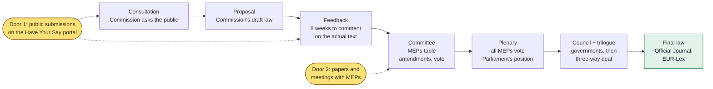
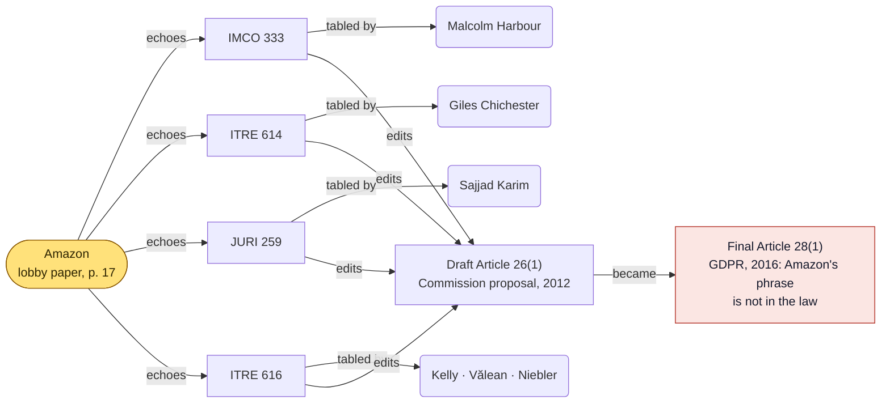
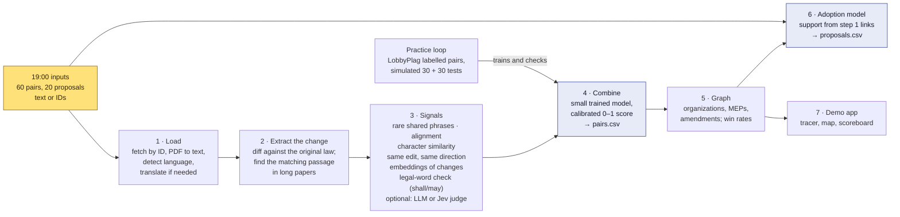

# Who Really Wrote This Amendment?

**Influence Graph Primer** · Reversa × Madrid Open · Challenge 03 · Saturday 3 October 2026

> **Superseded brief.** This page was written for the first Challenge 03 brief (60
> supplied pairs and 20 proposals scored as CSVs). The organizers replaced it at kickoff on
> 3 October with **The Influence Atlas**; read the
> [Atlas explainer](influence-atlas-primer.md) first. Sections 1–4 here (how an EU law is
> made, amendments, lobbying, the boilerplate trap) still hold. Sections 6 and 9–13
> describe the old hidden test and the old seven-part architecture.

This page explains Challenge 03 from zero: how a law is made in the EU, what amendments
and lobbying are, how an amendment can be traced back to the organization that wrote it,
what “the graph” and “who wins” mean, what the finished product would look like, and the
architecture and tools we propose.
Apart from a quick prototype, nothing is built yet; this is the design we agree on before
writing code.

Facts carry a tag: `verified` means we read the source today, `measured` means we
computed it ourselves from public data, `reported` means it comes from a summary we could
not open directly.
Every tagged fact is listed with its source in the research catalogs (see
[Sources](#sources)).

A styled version of this page is
[published separately](https://claude.ai/artifact/HL1KzDHpMWYerESyy3pLje) (private; the
owner shares it from its Share menu).

## Contents

- [Start Here](#start-here)
- [1. How an EU Law Is Made](#1-how-an-eu-law-is-made)
- [2. What an Amendment Looks Like](#2-what-an-amendment-looks-like)
- [3. What Lobbying Is](#3-what-lobbying-is)
- [4. How We Trace an Amendment Back](#4-how-we-trace-an-amendment-back)
- [5. The Graph, and Who Wins](#5-the-graph-and-who-wins)
- [6. Predicting What Gets Adopted](#6-predicting-what-gets-adopted)
- [7. What the Product Looks Like](#7-what-the-product-looks-like)
- [8. Existing Systems, and How They Fail](#8-existing-systems-and-how-they-fail)
- [9. Why It Is Rated 5 out of 5](#9-why-it-is-rated-5-out-of-5)
- [10. How We Can Win](#10-how-we-can-win)
- [11. Proposed Architecture](#11-proposed-architecture)
- [12. Tools, Including Jev](#12-tools-including-jev)
- [13. Decisions for You](#13-decisions-for-you)
- [Sources](#sources)

## Start Here

### Your Example, Made Precise

Your picture is close.
Imagine Google wants EU rules that let its self-driving cars operate in Europe (an
imagined example). Here is what actually happens, step by step:

1. The European Commission writes a draft law and asks the public for comments.
   Google, carmakers, consumer groups and anyone else can send a comment or a position
   paper. Google is listed in the EU's lobby register.
2. Google's lawyers write their wishes as **ready-made edits** to the draft: “in Article
   12, after ‘the operator’, insert ‘except where the vehicle is supervised remotely’.”
   They publish this and send it to many members of the European Parliament (MEPs),
   usually those on the committee handling the law, often in several political parties.
   Not to just one.
3. Some MEPs agree, or are persuaded, and **table** (formally submit) that edit as an
   amendment under their own name.
   Sometimes word for word, sometimes reworded.
   This is legal. The problem is that the public cannot see who really wrote it.
4. Our system receives the amendment and a candidate lobby submission, and scores how
   likely it is that the amendment came from that submission: 1 means “copied or adapted
   from it”, 0 means “unrelated, even if it looks similar”.

Two refinements: lobbies are not only companies.
Among the GDPR pairs that volunteers checked, the organization with the most verified
copies is a digital-rights NGO. And “who wins” is not “whose text got tabled” but “whose
change ended up in the final law”. Amazon got its wording into at least four amendments
and still lost, as section 5 shows.

## 1. How an EU Law Is Made

The European Union is 27 countries that make some laws together, and those laws then
apply in all 27. A familiar example is the GDPR, the privacy law behind every cookie
banner. Three bodies make EU laws `reported`:

- **European Commission.** The EU's executive and civil service.
  Writes the first draft, called the **proposal**. Runs public consultations before and
  after drafting.
- **European Parliament.** 720 elected members (**MEPs**), like members of a national
  parliament. They edit the draft by tabling **amendments** and vote.
- **Council of the EU.** Ministers from the 27 national governments.
  They also edit and vote. Parliament and Council must agree on one final text.

*The ordinary legislative procedure, simplified, with the two doors where lobby text
enters. Challenge 03's **Step 1 · Match** asks whether an amendment (Committee) came from
a submission (Feedback); **Step 3 · Predict** asks whether a consultation proposal ends up
in the final law. Step 2 (the graph) is built from the links that Step 1 finds.*

Three details matter for us:

- **The 8-week feedback window.** After the Commission adopts a proposal, anyone has 8
  weeks to comment on the actual legal text on the Have Your Say portal, and the
  Commission summarizes this feedback for Parliament and Council `reported`. Submissions
  in this window often contain ready-made edits.
  These are the “submissions” in the hidden test.
- **The committee stage.** Parliament gives each law to a lead committee and names a
  **rapporteur**, the MEP in charge.
  Committee members table numbered amendments; in plenary, amendments come from the
  committee, a political group, or at least 36 MEPs `reported`. Thousands of amendments
  are normal for a big law: LobbyPlag collected 4,867 committee amendments for the GDPR
  alone `measured`.
- **Article numbers move.** The GDPR's draft Article 26 became Article 28 in the final
  law `measured`. Matching across versions has to follow the text, not the number.

## 2. What an Amendment Looks Like

An amendment is a numbered, proposed edit.
Parliament prints it as two columns: the Commission's text on the left, the changed text
on the right. Here is a real one from the GDPR, 2012 (procedure `2012/0011(COD)`), with
the added words in bold italics:

**Amendment 616** · ITRE committee · Article 26, paragraph 1 · Tabled by Seán Kelly,
Adina-Ioana Vălean, Angelika Niebler

| Text proposed by the Commission | Amendment |
| --- | --- |
| 1. Where a processing operation is to be carried out on behalf of a controller, the controller shall choose a processor providing sufficient guarantees to implement appropriate technical and organisational measures and procedures … | 1. Where a processing operation is to be carried out on behalf of a controller ***and which involves the processing of data that would permit the processor to reasonably identify the data subject***, the controller shall choose a processor providing sufficient guarantees to implement appropriate technical and organisational measures and procedures … |

*Text from the LobbyPlag data repository, which holds the committee amendments as
published `measured`. The paragraph continues identically on both sides.*

In plain words: if a company hires another company to handle people's personal data
(say, a cloud host storing its files), it must pick one that protects that data properly.
The added words narrow the rule to cases where the hired company could actually tell who
the person is. That suits a cloud provider storing data it cannot read.

Where did those words come from?
Amazon's lobby paper proposed exactly this insertion at exactly this place.
Section 4 shows how we can tell.

## 3. What Lobbying Is

**Lobbying** means organizations trying to shape laws that affect them.
Companies, industry associations, consultancies, law firms, NGOs, unions and campaign
groups all do it. In the EU it is legal and regulated, not secret by default:

- **17,469 organizations** are in the EU Transparency Register as of 1 October 2026
  `verified`. The largest declared lobby budget is 12.73 million euros.
- Tech-sector lobbying of EU institutions rose from 113 million euros a year in 2023 to
  151 million in 2025, according to Corporate Europe Observatory and LobbyControl
  `verified`.
- Rapporteurs, shadow rapporteurs and committee chairs must publish their meetings with
  lobbyists for each report `reported`.

Why do MEPs table lobby text?
Lobbyists bring expertise and offer ready-written amendments, which saves drafting work,
and an MEP who agrees with a position may simply use the wording offered.
What the register does not show is **which sentences** in a law came from whom.
That is the gap this challenge fills.

### Three Real Cases

- **Amazon and the GDPR (2012–2016).** Amazon's phrase “would permit the processor to
  reasonably identify the data subject” appeared in four amendments tabled by different
  MEPs in three committees, each verified by volunteers `measured`. It is absent from the
  final GDPR `measured`.
- **OpenAI and the AI Act (2022–2023).** Documents obtained by TIME show OpenAI argued
  that general-purpose systems like GPT-3 should not count as “high risk”; several of its
  proposals appeared in the text Parliament approved in June 2023 `verified`.
- **Big Tech and the Digital Omnibus (2025–2026).** In January 2026 Corporate Europe
  Observatory compared, article by article and by hand, the Commission's Digital Omnibus
  with Big Tech lobby positions, for example on whether pseudonymised data counts as
  personal data `verified`.

The third case is the work this challenge asks us to automate: experts reading papers
side by side, slowly, for one law at a time.

## 4. How We Trace an Amendment Back

Copying leaves fingerprints.
When someone copies an edit, the result shares **rare** wording with the source, makes
the **same edit at the same place**, and pushes the law in the **same direction**. Our
job is to measure those three things and ignore everything else.

### The Trap: Everyone Quotes the Same Law

An amendment and a lobby paper both repeat the Commission's original sentence, then
change a few words. Compared as whole texts, any two edits to the same paragraph look
alike. Compare only the words each side changed and the picture flips.
Measured on GDPR Article 26(1), comparing Amazon's paper with five amendments to the same
paragraph (0 means nothing in common, 1 means identical) `measured`:

| Amendment | Status | Whole text | Changed words only |
| --- | --- | ---: | ---: |
| `ITRE 616` (Kelly, Vălean, Niebler) | Verified copy | 0.96 | 0.67 |
| `ITRE 615` (Rohde, Vălean) | Never checked, contains Amazon's phrase | 1.00 | 0.98 |
| `LIBE 1774` (Vălean, Rohde) | Never checked, contains Amazon's phrase | 0.95 | 0.65 |
| `LIBE 1773` (Alvaro) | Different edit | 0.63 | 0.12 |
| `LIBE 1775` (Stadler) | Different edit | 0.60 | 0.06 |

Unrelated edits score about 0.6 on whole text because they share the quoted law; on
changed words alone they drop to about 0.1. That one idea, **compare the edits, not the
documents**, is the core of our design.

### Six Traps the Hidden Decoys Can Use

1. **Quoted original text.** Shared by every edit to the same paragraph.
2. **Boilerplate.** “Member States shall ensure that” appears in thousands of laws.
   We measured how rare each phrase is across 354,985 EU legal documents: “shall” scores
   0.10 on a 0–1 rarity scale, “member states shall” 0.25, Amazon's “reasonably identify”
   0.78 `measured`.
3. **Rewording.** Words swapped, sentences reordered; exact matching misses it.
4. **Translation.** Submissions arrive in any of the EU's languages.
5. **Same topic, opposite request.** A consumer group and Amazon can both target Article
   26 and ask for opposite changes.
6. **Tiny words with big meaning.** “Shall” (must) becoming “may” (allowed to) is one
   word that reverses the obligation.

### The Signals We Combine

- **Rare shared phrases.** Shared word sequences in the changed text, weighted by rarity,
  so boilerplate counts for nothing.
- **Alignment.** The longest matching stretch, allowing small insertions, the way DNA
  sequences are compared (Smith-Waterman).
- **Same edit, same direction.** Both insert, or both delete, the same thing; the
  amendment moves the law toward the submission's wording.
- **Meaning.** Embeddings or a language model judge paraphrases and translations, applied
  to the changes only.

A small model trained on real labelled examples weighs these signals into one score from
0 to 1. Section 10 shows how well a first version of this did.

## 5. The Graph, and Who Wins

A **graph** in this sense is not a chart.
It is a set of dots (called **nodes**) joined by lines (called **edges**). Each dot is a
thing, each line is a relationship.
Ours has four kinds of dot: organizations, amendments, MEPs and articles of the law.
The lines say “echoes” (an amendment copies an organization's text, with our score as its
strength), “tabled by”, “edits” and “became”. Here is the real Amazon example:

*Amendments and authors from LobbyPlag's verified matches; final text from the
Publications Office `measured`. Tabling lobby wording is legal; the graph shows text
reuse, not wrongdoing.*

### What “Who Wins” Means

An organization's request can get three levels far.
We measure each one separately:

| Level | Meaning | Amazon, Article 26(1) |
| --- | --- | --- |
| **Heard** | At least one MEP tabled its wording | Yes, four amendments, six MEPs |
| **Adopted by Parliament** | The amendment passed Parliament's vote | Not measured yet |
| **Won** | The change is in the final law | No |

Across a whole law, each organization gets a **win rate**: changes in the final law
divided by changes it asked for. Each MEP gets a **carry rate**: how many of their
amendments echo lobby text.
LobbyPlag reported that for some MEPs about a quarter of their GDPR amendments contained
lobby text `reported`. The demo answers the brief's question, “who wins most often?”,
from these numbers.

The “heard” level already shows something interesting in the GDPR data.
Counting volunteer-verified copies `measured`:

| Organization | Requests extracted | Requests echoed | Amendments echoing them | Different MEPs |
| --- | ---: | ---: | ---: | ---: |
| European Digital Rights (NGO) | 209 | 50 | 78 | 11 |
| Bits of Freedom (NGO) | 108 | 16 | 19 | 4 |
| American Chamber of Commerce to the EU | 232 | 5 | 18 | 7 |
| Amazon | 98 | 5 | 17 | 13 |
| European Banking Federation | 113 | 6 | 13 | 11 |

*These counts reflect which pairs volunteers had time to check, so they are a lower
bound, not a ranking. Our system would score every pair automatically.*

## 6. Predicting What Gets Adopted

Step 3 gives us 20 suggestions from a consultation and asks, for each, the probability
that it ends up in the final law.
It is scored by **AUC**: pick one suggestion that made it and one that did not; AUC is
how often we gave the first a higher probability.
0.5 is coin-flipping, 0.75 is the “excellent” bar.

Signals that plausibly predict adoption, all available before the final vote:

- **Did an MEP table it?** Step 1's links feed straight in: a suggestion echoed by many
  amendments, from several parties, has support.
- **How many organizations asked for the same thing?** A request backed by many
  different organizations may carry more weight than a lone voice.
- **Who asked.** Business, NGO, public authority, size and lobby budget (from the
  Transparency Register).
- **What kind of change.** Deleting a phrase or clarifying a definition is smaller than
  adding a new obligation.
- **Direction.** Whether it goes with or against what Parliament's and Council's
  positions already say.

Heike Klüver's research measured EU lobbying success this way, comparing consultation
positions with final policy across 56 issues and 2,696 groups `reported`. One open
question for the organizers: may we compare a suggestion with the final law's text when
the law is already adopted? That would be measurement rather than forecasting, and would
score far higher. With only 20 suggestions, luck plays a large part either way.

## 7. What the Product Looks Like

Reversa sells to multinationals, public affairs consultancies, Big Four firms and law
firms `reported`. Their question is practical: **who shaped the last law, and how do we
plan our position on the next one?** Our demo would be a small version of the tool they
would pay for. Three screens:

**Screen 1 · Influence Tracer** · GDPR · `2012/0011(COD)` · Article 26(1) · *illustration:
scores are examples, not results*

> **Amendment** `ITRE 616` · Kelly, Vălean, Niebler
>
> … on behalf of a controller ***and which involves the processing of data that would
> permit the processor to reasonably identify the data subject***, the controller shall
> choose …
>
> Changed words are highlighted; the rest is the Commission's text and is ignored when
> matching.

| Likely source | Score | Why |
| --- | ---: | --- |
| Amazon · lobby paper p. 17 | **0.97** | Rare phrase shared: “reasonably identify the data subject” · same insertion, same place · same direction: narrows the rule |
| Another submission on Article 26 | 0.08 | Same article · different edit · only boilerplate shared |

The tracer: pick any amendment, see where it most likely came from, and why, in words a
lawyer can check.

- **Screen 2 · Influence map.** The graph from section 5 for a whole law: click an
  organization to see every amendment that echoes it and which survived.
- **Screen 3 · Scoreboard and forecast.** Organizations ranked by heard, adopted and won;
  for open consultations, the probability each request makes it into the law.

The tracer is also the core of the five-minute demo: one real amendment, the evidence
highlighted, then the map, then “who wins”.

## 8. Existing Systems, and How They Fail

People have traced copied law text before.
Each approach breaks on one of the traps from section 4:

| System | How it matches | How it fails |
| --- | --- | --- |
| **LobbyPlag** (2013, GDPR) | Word-triplet overlap of whole texts on the same article; volunteers check candidates | Whole texts share the quoted law, so lookalikes score high (one rejected pair scored 1.00); 1,701 of 1,976 candidates never checked `measured` |
| **Legislative Influence Detector** (2016, US states) | Search engine finds candidates; Smith-Waterman alignment scores them | Exact words only, so rewording escapes; boilerplate gives false positives; low scores need manual review `verified` |
| **Copy, Paste, Legislate** (2019, USA TODAY) | Shared strings of six or more words, scored 0–100 | In their words, a bill that copied an idea but not the precise language was not flagged; needed 30+ reporters to review `verified` |
| **EPFL study** (2023, European Parliament) | Meaning similarity and entailment between lobby papers and MEP speeches | Finds who agrees, not who wrote it; no ground truth, checked against retweets and meetings (AUC 0.77) `verified` |
| **Whole-text embeddings** (the obvious modern approach) | Cosine similarity of AI text embeddings | On the GDPR data, lookalike decoys score higher (0.84) than real copies (0.78) `measured` |
| **NGO and press analyses** (CEO, TIME) | Experts read documents side by side | Accurate but slow and manual; no scores, one law at a time `verified` |

Reversa's own product does not claim lobby tracing yet `verified`. The brief says these
are problems their team is working on now.

## 9. Why It Is Rated 5 out of 5

1. **No answer key for the test law.** We must find our own labelled practice data.
   LobbyPlag's GDPR set is the only public one we found: 175 verified copies and 100
   rejected lookalikes `measured`.
2. **The decoys are designed to fool exactly the obvious methods.** Same article, same
   quoted law, same topic.
3. **Paraphrase and translation.** “Paraphrases included” is the brief's bar for
   excellent.
4. **Messy data plumbing.** Submissions are PDFs in many languages; amendments sit in a
   120 MB dump; EUR-Lex and Parliament's own sites block scripts; the Publications
   Office and Parltrack are working routes around them.
5. **Three different problems in one.** Text matching, network analysis and forecasting.
6. **Unknown input format, one hour, no hands.** At 19:00 we learn whether pairs arrive
   as text or as IDs, and hand labelling disqualifies.
7. **Tiny forecasting test.** Twenty adoption predictions, so a few lucky or unlucky
   calls move the AUC a lot.

## 10. How We Can Win

The event score is 60% hidden test, 20% difficulty and 20% demo `verified`. Difficulty is
already maximal for this challenge if we deliver all three steps.
So the plan is:

### The Hidden Test (60%)

We built a quick prototype before we agreed this design, which you can keep or discard.
On simulated hidden tests built from LobbyPlag (30 real copies against 30 rejected
lookalikes, each lobby organization kept out of its own training data), it scored
`measured`:

| Scorer | Precision in top 20 | Recall | AUC |
| --- | ---: | ---: | ---: |
| **Change-based prototype, lobby text as clean edits** | **1.00** | **0.82** | **0.93** |
| Same prototype, lobby text as a whole paper | 0.91 | 0.65 | 0.87 |
| LobbyPlag's own matcher | 0.86 | 0.68 | 0.81 |
| Whole-text similarity | 0.86 | 0.74 | 0.73 |
| *Brief's “excellent” bar* | 0.90 | 0.80 | — |

Read this with care: the practice set is one law from 2013, mostly word-for-word copies.
The real test promises paraphrases, so the whole-paper row is the more realistic one, and
recall there is the weak spot. Ways to raise it:

- Better passage finding inside long papers, so the system compares the right paragraph.
- A meaning judge (a language model or Jev, section 12) applied to the extracted changes,
  to catch paraphrases.
- Calibration: the test is half real, half decoy, so roughly half our scores should sit
  above 0.5. We must ask how recall is computed from scores.

### The 19:00 Hour

One command turns whatever arrives into both CSV files.
We rehearse it tonight against a timer, with inputs as text and as IDs.
A model that is not finished at 19:00 is worth nothing; a simpler model that runs is
worth 60%.

### The Demo (20%)

Five minutes, for a non-lawyer: the Amazon amendment with its evidence highlighted, the
influence map, the scoreboard, and the punchline that being heard is not winning.

## 11. Proposed Architecture

Seven parts. Each box is one module with one job, so three people can build in parallel:

*Parts 1–4 produce the first CSV and part 6 the second; parts 5 and 7 serve the demo.
The practice loop trains the combiner and tells us whether any change helps.*

Design rules we propose:

- **Raw model output stays separate from labels.** Every score is logged with its signals
  so the demo can explain it and we can check it.
- **Every part degrades gracefully.** If translation or the language-model judge fails at
  19:30, the score still comes out from the other signals.
- **No hand labelling, anywhere.** The pipeline writes the CSV; humans only press run.

## 12. Tools, Including Jev

### Can Jev Score Pairs From 0 to 1?

Yes. Jev, from TypeSafe AI, is not a chatbot: you send it a question and it returns a
typed answer with probabilities instead of text.
Its yes/no question type, called **Noul**, returns the probability that the answer is
yes `verified`. We could ask: “Does the amendment's change copy or adapt the change this
submission requests?” and use the probability as a score.
It costs 0.042 dollars per million input tokens (word pieces) with free output, so all 60
pairs would cost under one cent `verified`.

Four cautions before we rely on it:

- **Its probability is not our score yet.** “0.8” from Jev has to be checked against real
  labels. We would measure it on LobbyPlag's 275 labelled pairs before the event and let
  the combiner decide its weight.
- **Give it the changes, not the documents.** Its documentation lists long irrelevant
  context as a known weakness, and whole texts are exactly where the decoys hide.
- **English is its strongest language,** and it has no published results on legal text.
- **It needs an account and an API key**, and your approval to send public text to
  TypeSafe. There is no key on this machine.

The same applies to Claude (Sonnet 5.5 at 2/10 dollars per million tokens in and out,
Opus 5.5 at 4/20) `reported`: strong judgment, multilingual, and can also return the
matching phrases the demo shows; but it needs a key too, and its stated probabilities
need the same calibration. A free local model is the fallback if we cannot use either.

### Proposed Tools per Part

| Part | Proposed | Alternatives | Why |
| --- | --- | --- | --- |
| Load: data | Have Your Say API, Parltrack dumps, Publications Office (EUR-Lex texts) | Transparency Register, LobbyFacts | All public and tested today; the Publications Office route works where EUR-Lex blocks scripts |
| Load: PDFs | pypdf | Docling (keeps table columns apart) | Fast; Docling if two-column amendment PDFs come out merged. PyMuPDF avoided for its AGPL licence |
| Load: language | Lingua detector, OPUS-MT translation | Language-model translation | Offline and free; NLLB avoided because its licence forbids commercial reuse |
| Signals: words | Rarity table from 355k EU texts, RapidFuzz, our own alignment | — | Tested in the prototype; boilerplate-proof |
| Signals: meaning | Multilingual paraphrase embeddings on changes | BGE-M3, Qwen3 embeddings, bge-reranker, multilingual entailment model | Rerankers are trained for “same topic”, the decoys' trick, so they must be measured before use |
| Signals: judge | Decision needed | Jev, Claude, local Qwen3 via MLX | See above |
| Combine | scikit-learn logistic regression with calibration | Gradient boosting | Stable on 275 examples; each weight can be explained in the demo |
| Graph | NetworkX | — | Standard, simple |
| Demo | Decision needed | Streamlit (fast, Python) or Next.js with Cytoscape.js (polished) | Trade build time against polish |

The full catalog, with licences, versions, costs and risks for 28 tools, is in
[tools.yaml](../research/influence-2026-10/tools.yaml).

## 13. Decisions for You

Nothing gets built until these are settled:

| | Decision | Options |
| --- | --- | --- |
| **D1** | Language-model judge | None (local signals only), Jev, Claude, or a local model. Jev or Claude needs an account, a key and your approval to send public text to that company. |
| **D2** | Demo app | Streamlit (hours to build, plainer) or Next.js (polished, more work on the day). |
| **D3** | The prototype | Keep it as the starting point after you have read it, or rebuild from this design. |
| **D4** | Team split | Who owns which parts. A natural split: data and loading (part 1), matching (parts 2–4), graph, adoption and demo (parts 5–7). |
| **D5** | Questions to the organizers | Do pairs arrive as text or IDs? How is recall computed from scores? May step 3 use the final law's text? May we prepare code and data before Saturday? |

## Sources

Every tagged fact on this page is recorded, with its source and status, in three
validated research catalogs in the repository:
[facts.yaml](../research/influence-2026-10/facts.yaml),
[existing-systems.yaml](../research/influence-2026-10/existing-systems.yaml) and
[tools.yaml](../research/influence-2026-10/tools.yaml). The main public sources:

- Organizers' brief: [madrid-open-reversa-challenges.pdf](../brief/madrid-open-reversa-challenges.pdf)
- [LobbyPlag data repository](https://github.com/lobbyplag/lobbyplag-data) (GDPR
  amendments, lobby proposals, verified matches)
- [Final GDPR text](http://publications.europa.eu/resource/celex/32016R0679)
  (Publications Office)
- [LobbyFacts](https://www.lobbyfacts.eu/) (Transparency Register data)
- [Corporate Europe Observatory, January 2026](https://corporateeurope.org/en/2026/01/article-article-how-big-tech-shaped-eus-roll-back-digital-rights)
  (Digital Omnibus and lobby spending)
- [TIME, 20 June 2023](https://time.com/6288245/openai-eu-lobbying-ai-act/) (OpenAI and
  the AI Act)
- [Legislative Influence Detector](https://dssgfellowship.org/lid/)
- [Copy, Paste, Legislate: method](https://publicintegrity.org/politics/state-politics/copy-paste-legislate/how-we-uncovered-10000-times-lawmakers-introduced-copycat-model-bills-and-why-it-matters/)
- [Suresh and co-authors, Studying Lobby Influence in the European Parliament](https://arxiv.org/abs/2309.11381)
- [TypeSafe Jev documentation](https://docs.typesafe.ai/primitives/noul)

*Prepared 2 October 2026 for the team's Challenge 03 entry.
Tracked as tasks rev-enx3, rev-tm4a and rev-t50d.*
