# The Influence Atlas: Consolidated Execution Plan

3 October 2026, Madrid. Tracked by bead `rev-f090`. Status: `proposed` until the project
owner merges the pull request that adds this file; the eight-part architecture it builds
on was agreed when the owner merged PR #21.

On 3 October, three documents described our Challenge 03 entry. They were written in
parallel and do not fully agree:

- the **uploaded technical plan**, [`docs/brief/PLAN.md`](brief/PLAN.md): an eleven-stage
  pipeline with concrete tools, thresholds and a repository layout;
- the **Atlas explainer**, [§6](explainer/influence-atlas-primer.md#6-the-architecture):
  the eight-part architecture plus a practice loop, and why;
- the **technical design**, [`docs/design/influence-atlas-design.md`](design/influence-atlas-design.md):
  typed record contracts, acceptance tests and a seven-step delivery sequence.

Two plans would mean two pipelines built by different people. This file gives one answer
wherever the three disagree, says why, and orders the work as acceptance gates mapped to
the existing beads. It adds no code and selects no model provider.

Facts carry the explainer's tags: `verified` (primary source read today), `measured`
(computed by us), `reported` (secondary source), `proposed` (our choice, not yet agreed),
`assumed` (an estimate).

## Contents

- [1. Which Document Answers What](#1-which-document-answers-what)
- [2. Checked Against the Brief](#2-checked-against-the-brief)
- [3. What All Three Agree On](#3-what-all-three-agree-on)
- [4. Where They Differ, and the Choice](#4-where-they-differ-and-the-choice)
- [5. The Generic Law Path](#5-the-generic-law-path)
- [6. Typed Partial Results](#6-typed-partial-results)
- [7. Counting Wins Honestly](#7-counting-wins-honestly)
- [8. Acceptance Gates, in Order](#8-acceptance-gates-in-order)
- [9. Dependencies: What We Add and What We Do Not](#9-dependencies-what-we-add-and-what-we-do-not)
- [10. What This Plan Leaves Open](#10-what-this-plan-leaves-open)

## 1. Which Document Answers What

| Question | Answered by |
| --- | --- |
| What the jury asks for and how it scores | [The Influence Atlas brief](brief/influence-atlas-challenge-brief.pdf) |
| Why we build it this way; the eight parts and their boundaries; the method | [Atlas explainer](explainer/influence-atlas-primer.md), §6 and §7–§9 |
| The shape of every record and each part's completion test | [Technical design](design/influence-atlas-design.md) |
| What we build, in which order, with which tools, and when we cut | **This plan** |
| What is built, verified and decided right now | [Implementation status](implementation-status.md) |
| Who is working on what | tbd beads (`tbd ready`) |

The uploaded plan stays unchanged as an input. Where it differs from this file, this file
applies (§4 lists every difference). A pull request that departs from this plan changes
this file in the same pull request, so the next person builds the current plan.

## 2. Checked Against the Brief

Read again, page by page, at 12:10 on 3 October (`verified`, the 12-page PDF). Every
requirement below has an owner in this plan; the right column names where.

| Brief | Requirement | Where this plan answers it |
| --- | --- | --- |
| p. 4, the challenge | Which companies and people get their way; all of Europe from 2019; thousands of submissions and amendments; one graph | Gates 1–6 for one law, gate 9 for the batch since 2019; one graph across laws (part 6) |
| p. 4, the trap | Similar wording proves nothing; "real influence is usually reworded, and that is what we want you to catch" | Masking and rarity (part 4); the reworded tier, published at its audited precision; D1 decided by the 13:30 checkpoint (§10), because catching paraphrase is what the judge or the meaning signals are for |
| p. 5, five questions | WHO, WHAT, TOWARDS (and does it match what they say in public), HOW (consultations, meetings, MEPs, coalitions, timing), NEXT | The report must answer all five (gate 8). TOWARDS and HOW have a required minimum (gate 7b) so no question goes unanswered |
| p. 6, map | Actor → ask → amendment → final article since 2019, "enriched with public positions" | Parts 1–6; public positions enter the graph as dated context nodes beside the asks (design, PublicPosition) |
| p. 6, rank | Ranked by real wins, by topic and by year | Part 7 rank with §7's counting; topics from Legislative Observatory subject codes |
| p. 6, explain | What each actor says in public versus what it asks, and the playbook that wins | Gate 7b minimum, gate 10 in full |
| p. 6, forecast | Who is rising and fading; which asks will land in laws negotiated now | Gate 9 with rolling time splits; open files need asks from Have Your Say and amendments from the EP after Parltrack's February 2026 cut-off (a stated risk) |
| p. 6, hand-in | A graph explored live, a short public report on the five questions, a repository anyone can rerun | Gates 6, 8 and 11 |
| p. 7, data | The EU record (register, meetings, Have Your Say, Legislative Observatory, amendments, HowTheyVote, EUR-Lex, LobbyFacts); public voice (websites, position papers, press releases, op-eds, social media, news through GDELT); then go global | The EU record: §5. Public voice: organizations' own websites, position papers and press releases, for a sample of actors. **Cut today, and said so in the report**: social media; GDELT (rate-limited from our network, `verified`); non-EU registers (the US disclosure API answered 403, `verified`) |
| p. 7, "the magic is in the comparison" | What an actor says in public, what it asks, and what ends up in the law, side by side | The evidence card (part 8) plus gate 7b's public-voice cards for the actors with the strongest links |
| p. 8, the bar | Every edge shows the ask, the amendment and the final article; wins "even when it is not who spends most"; positions and the playbook; the next years with reasons; a report a journalist could publish | Parts 4, 5 and 8; wins against spend (§4, part 7); forecasts with reasons (gate 9); the report outline in explainer §11 |
| p. 9, scoring | Real links 25, any law 20, insight 25, report 15, ambition 15, all checked live | Gates 3 and 7 (real links), 6 (any law: results "in minutes, and they hold up", so the any-law page shows only links above the same threshold), 7b and 8 (insight, report), 9 (ambition) |
| p. 10, rules | No data or labels handed out; public sources only; public repository with an open licence; teams of three or four; "your own models, editors and agents" | Labels are our own audit, kept apart; D6 before 19:30 (gate 11); the rules allow our own models, so D1 is the owner's call on cost and measured gain, not a rules question |
| p. 11, the day | Demos at 19:30, five minutes each | The explainer's five-minute demo script (§11) and the cut lines in §8 |

What the brief does not say, and we therefore treat as open: whether code written before
today may be used ("nothing prepared, on purpose", `rev-qvmx`), and the exact meaning of
"since 2019" (§10).

## 3. What All Three Agree On

These hold without change. Each is in the uploaded plan and in the explainer or design.

- **Evidence first.** Every link stores the ask's passage, the amendment's change and,
  when it won, the final article, with source URLs, so a reader can check it side by side.
- **Precision over recall.** The jury reads three random links: with precision p, all
  three pass with probability p³ (0.90 → 0.73, 0.95 → 0.86). Show only high-confidence
  links by default; keep the rest in a labelled, separate view.
- **Law-agnostic.** No per-law code, tuning or hand-picked documents. A law's scores are
  read against that law's own background, not a global constant.
- **Cheap before expensive.** Lexical and embedding filters find candidates; careful
  checks run only on the shortlist.
- **Never an empty screen.** A missing source becomes a labelled partial result (§6).
- **Careful wording.** "The ask appears in the amendment", never "X wrote the law". Echo
  is not causation; a meeting is context, not proof.
- **Match on the change, not the document.** Compare what an amendment inserts or deletes
  with what a passage asks for; mask text quoted from the proposal.
- **Stream big dumps, fetch actors by key.** Read Parltrack line by line and keep the
  procedure's rows; look up register and meeting data only for actors that appear.
- **Retrieval method.** BM25 plus a multilingual dense encoder, merged by reciprocal rank
  fusion (each candidate scores the sum of 1/(60 + rank)); a passage naming the amended
  article gets a small boost; rare n-gram anchors absent from the base text; matching
  numbers; the amendment's location as a soft prior, never a filter.
- **Date gate.** A source published after an amendment cannot be its origin; an undated
  source is ineligible, never passing.
- **Measure precision by a blind random audit** with a Wilson interval, a printed seed,
  and labels kept apart from model output.
- **Outcomes never rely on article numbers**: final acts renumber.
- **Rankings shrink small numbers** (a beta-binomial prior) and show counts beside rates.
- **Out of scope today**: fine-tuning, large local models, social media, news mining and
  non-EU registers. The brief lists the last three as sources (p. 7); §2 says why each is
  cut, and the report says so too.

## 4. Where They Differ, and the Choice

Each row: what the uploaded plan proposes, what we do instead (`proposed`), and why.
Rows the uploaded plan got right but under-specified say "Retained, with".

### Engineering Base

| Topic | Uploaded plan | Consolidated choice | Why |
| --- | --- | --- | --- |
| Where code lives | New `atlas/` package, `web/` static app, `config.yaml` | Extend `backend/src/influence/` (routers → services → repositories, typed schemas) and `frontend/` | One implementation per job (architecture skill); the existing gates (strict types, 100% branch coverage, Biome) already cover these trees |
| Storage | DuckDB tables, Parquet per stage | JSON Lines per record type per law; standard-library `sqlite3` only if cross-law joins need it, after a benchmark | No new dependency; one law fits in memory (60,000 passages, 246 MB index, `measured`) |
| Stage runner | `@stage` decorator, Parquet cache, `--from <stage>` | Retained, with plain functions per part, outputs keyed by input hashes, a run manifest, and `--from` and `--refresh` flags | Same rerun behaviour without a framework |
| Run outputs | One `out/<law>/` folder per law | Each run writes a fresh run directory and is marked complete only after every artifact validates | The submission command's two renames are not a transaction (design, PR #19 assessment) |
| Configuration | `config.yaml` with defaults, including thresholds | Typed settings in Python, recorded in every run manifest; thresholds come from practice-loop output files, not defaults | A threshold must cite the evidence that set it (`AGENTS.md`, evaluation rule) |
| Entry points | `atlas run --law X` | `influence collect <procedure>` and `influence atlas <query>` on the existing CLI; `make atlas`, `make atlas-sample` (`proposed` names) | One CLI, one install |

### Part 1 · Collect

| Topic | Uploaded plan | Consolidated choice | Why |
| --- | --- | --- | --- |
| Reading Parltrack | `zstandard` package | Python 3.14's `compression.zstd` | Standard library; streamed 1,272,091 amendments in 6 s (`measured`) |
| Law texts | `eurlxp` scraping EUR-Lex HTML, or SPARQL | CELLAR only: one SPARQL query maps the procedure to proposal and final-act CELEX, then XHTML by content negotiation | The EUR-Lex website returns an empty bot-wall page to scripts (`verified`) |
| Proposal CELEX | Built as `5{year}PC{number:04d}` | Read from CELLAR (`dossier_initiated_by_act_preparatory`); the built form is only a cross-check | Verified for four procedures; a constructed ID can be wrong silently |
| Consultations | `hys-scraper` package, archived, last release 2023, untested | The Commission's own JSON endpoints, all verified today: `groupInitiatives`, `allFeedback`, `download` | Tested on the AI Act: 304 feedback items, 187 with a Register ID, 259 with attachments (`verified`) |
| Finding a law's consultation | Fuzzy title match plus a date window | Exact join on the COM reference, through a one-time index of the 4,128 initiatives; title search only as a labelled fallback | Have Your Say has no procedure field and cannot be searched by COM number (`verified`); a fuzzy join can attach the wrong consultation silently |
| HTTP | `httpx` async with `tenacity` retries | Standard-library `urllib` with a bounded retry loop and a per-host rate limit (EP API: 500 requests per 5 minutes); threads for attachment downloads | Downloads are a few hundred files per law; no async framework needed until measured |
| Passages | Chunks up to 350 tokens; `pymupdf`, `pysbd` | Passages of 1–3 sentences (about 40–120 words) overlapping by one sentence, with code-point offsets; existing `pypdf` extraction (PR #11) | The jury reads the evidence span: it must be short. `pdfplumber` or `docling` only for a measured extraction failure (`rev-xltz`) |
| Campaigns | `datasketch` MinHash-LSH; collapse a mass mailing into one node | Retained, with exact shingle Jaccard (standard library) per law, and the campaign kept as one ask jointly attributed to its listed members | A few hundred submissions per law is about 10⁵ pairs; a coalition is real influence, so its members stay visible |
| Languages | Detect and flag non-English | Retained, with a count per layer: a passage not analysed is shown as "not analysed (DE)", never skipped silently | Any-law check across languages (explainer §11) |
| Private individuals | Aggregated, never named | Retained (`EU_CITIZEN` records counted, not named) | Privacy |

### Parts 3 and 4 · Find Candidates and Verify Links

| Topic | Uploaded plan | Consolidated choice | Why |
| --- | --- | --- | --- |
| Short edits | Drop changes under 8 tokens unless they contain numbers | Keep every change. A short edit ("shall" → "may", an added "not", "sufficiently") is scored with the legal-polarity and direction signals (`rev-sbrp`). It cannot pass the copied tier on rarity alone; it can be published only through the reworded tier, at that tier's audited precision | The shortest edits often carry the legal effect; dropping them hides real wins and opposite requests |
| Justification text | A second query | Retained, with justification used for retrieval only, never as evidence that the change carries the ask | The justification paraphrases arguments; the change is what became law |
| Retrieval units and caps | Top 5 per amendment, 400 candidates live | Top 20 per retriever, fused, about 20–30 kept; the cap is a runtime budget set from measured recall@20 on LobbyPlag (`rev-00x6`) and recorded in the manifest | Measure retrieval recall before scoring (design); a cap chosen before measurement silently loses true pairs |
| Encoder | `multilingual-e5-small` | Chosen by recall@20 on LobbyPlag's 172 verified pairs among explainer §10's candidates (Qwen3-Embedding-0.6B first), in an isolated locked model environment | No encoder is measured on our data yet; choose by our numbers, not benchmark tables |
| Background scores | z-score against the law; forward and reverse (mutual) rank | Retained as signals of part 4 | They make a score relative to the law's own background |
| Combining signals | Hand-set weights (0.30 dense, 0.20 BM25, 0.25 alignment, 0.15 mutual, 0.10 numbers), "tune by reading edges" | A logistic regression over the signals, fitted on LobbyPlag with organization-grouped folds (the practice harness, PR #20) | Reading published edges to tune weights turns audit labels into training data without a held-out measure; fitted weights can still be explained in the demo |
| The judge | Anthropic SDK, small model, escalate to a large one in [0.45, 0.90] | Jev evaluation authorized by the owner (D1, `rev-jaig`); adoption remains subject to measured gain. The judge adds signals beside rarity, alignment, legal cues, background ranks and semantic similarity, never the verdict | The bounded Jev trial follows the owner’s later authorization; compare the full fitted signal set on the same folds and preserve source/date checks. See implementation status for results |
| Quote check | `rapidfuzz` partial-ratio alignment ≥ 90 | Exact substring after whitespace normalization, mapped back to half-open code-point offsets in the unmodified source (the existing `TextSpan` contract); no match, no span | A 90% fuzzy match can display words the source never contained, in front of the jury |
| Tiers | A: likelihood ≥ 0.85; B: 0.55–0.85; C: exported only | Tiers by kind of evidence: copied, reworded, same direction only (explainer §7). The threshold is set by the practice loop and frozen before the blind audit (`rev-zzur`); reworded links are shown only if their audited precision clears the bar | Thresholds on an uncalibrated score are guesses; until calibration exists we show a support score and its method, not a probability (design) |
| Several sources for one amendment | Pairwise model comparison picks the likely source and splits credit | Show every supported alternative; flag coalitions | Shared text supports an association, not unique authorship (design) |
| Audit | `atlas audit --law X --n 30`, Wilson interval | Retained, with uniform sampling from all published links by law and tier, a printed seed, two blind readers, 40 links planned (`rev-sn3u`) | 30 of 30 correct is the minimum to claim precision ≥ 0.89 (explainer §7) |

### Part 5 · Trace Outcomes

| Topic | Uploaded plan | Consolidated choice | Why |
| --- | --- | --- | --- |
| Outcome classes | LANDED_LITERAL, LANDED_REWORDED, PARTIAL, NOT_LANDED | Retained, with UNKNOWN (text missing or file open), a separate deletion win, a status-quo win kept apart from changing the text, and two stages: adopted by Parliament, then won in the final act | Unknown is not "not won"; mixing status-quo defence with change flatters defenders (explainer §8) |
| Survival test | Retrieve with the ask as query, then a second model prompt | Owner rule of 3 October: an ask is adopted when its requested wording survives in the final law, labelled automatically. Reworded survival (meaning signals) is reported as its own class, LANDED_REWORDED, never merged into the wording rule | The rule is decided (`rev-e5xh`, carried to `rev-uhpq`); the reworded class is `proposed` |

### Part 7 · Analyse

| Topic | Uploaded plan | Consolidated choice | Why |
| --- | --- | --- | --- |
| Credit for a shared ask | 1/N to each actor | No fractional credit: deduplicated denominators (§7) | 1/N invents a causal share nobody measured |
| Success against spend | Percentile of success minus percentile of spend | Residual of wins regressed on log declared spend (explainer §8), keeping the uploaded plan's minimum of 3 assessed asks, with n and an interval | One method, as agreed in the explainer; the minimum stops "1 of 1" from leading |
| Forecast validation | Leave-one-law-out (`GroupKFold` by law) | Rolling time splits by procedure completion date; every feature built from documents dated before the forecast cutoff; baselines: base rate and "the rapporteur's draft includes it"; AUC and Brier score | Leave-one-law-out trains on 2024 laws to predict 2021 laws: actor history and coalitions leak from the future |
| Forecast features | Author role, co-signatories, cross-group support, actor history, coalition | Retained, each computed at the cutoff, plus the explainer's direction and Council-position features | Same idea, without leakage |
| Rising actors | Theil-Sen slope with a minimum sample | Retained, normalized by consultations the actor took part in; "rising" only when the interval excludes zero | Raw counts grow with the number of consultations |
| Coalitions | Louvain communities with `networkx` | Clusters of the same ask first (part 1 campaigns, part 3 coordinated amendments); community detection only if a finding needs it | Fewer dependencies; the ask cluster is the evidence |

### Part 8 · Publish

| Topic | Uploaded plan | Consolidated choice | Why |
| --- | --- | --- | --- |
| Explorer | Static web app with Cytoscape.js | The existing Next.js explorer and three-column evidence workspace (PRs #12, #13, #17), extended with the final article: ask, amendment change against the proposal, final article, with dates and the rarity line | The workspace exists and passes the gates; a graph-drawing library is a new dependency decided in its own pull request |
| API | `POST /run`, server-sent events for progress, `GET /graph/{law}` | Thin FastAPI routes over the same services as the CLI; progress events only if the live any-law run needs them | The CLI is the primary path (architecture skill) |
| Report | Jinja2 template; a language model drafts the narrative | Numbers generated by reproducible queries into Markdown with the standard library; people write the narrative; no model drafting before D1 | Every claim links to its query; nobody edits the numbers |
| Precomputed laws | 10–15 laws into `demo/` | Retained as a cache under `data/laws/`, never a limit on which laws work; the flagship list is explainer §12 | Survives a network failure at 19:30 |

## 5. The Generic Law Path

The any-law check (20 points) needs one path for every law. The uploaded plan's resolver
and law bundle are the right shape; this section fixes their sources to the routes
verified in the [data-sources report](research/influence-atlas-2026-10/data-sources.md).

```mermaid
flowchart LR
  query["Law name, procedure,<br/>CELEX or COM number"] --> resolve["Resolve<br/>(catalog, aliases)"]
  subgraph sources["Public sources"]
    parl["Parltrack dumps<br/>amendments, dossiers, MEPs"]
    cellar["CELLAR<br/>proposal, final act"]
    epapi["EP API v2<br/>Parliament position"]
    hys["Have Your Say<br/>feedback, PDFs"]
    reg["Register, meetings,<br/>votes"]
  end
  resolve --> collect["1 · Collect<br/>law bundle + manifest"]
  sources --> collect
  collect --> actors["2 · Actors"] --> find["3 · Candidates"] --> verify["4 · Verify"]
  verify -->|"above threshold"| published["Published links"]
  verify -->|"below"| unconfirmed["Unconfirmed<br/>(audit view only)"]
  published --> trace["5 · Outcomes"]
  collect --> trace
  trace --> atlas["6 · Atlas graph"]
  published --> atlas
  atlas --> analyse["7 · Rank, explain,<br/>forecast (pre-cutoff)"]
  atlas --> publish["8 · Explorer, any-law<br/>command, report"]
  analyse --> publish
  practice["Practice loop<br/>LobbyPlag, blind audit,<br/>time-split backtest"] -.->|"threshold"| verify
  practice -.->|"backtest"| analyse
```

This is the target, not what runs today: [implementation status](implementation-status.md)
says which parts exist.

### Setup, Once

| Step | Output | Cost |
| --- | --- | --- |
| Stream Parltrack `ep_dossiers` (52.7 MiB) into a procedure catalog: reference, titles, subject codes, stage, final-act CELEX from `procedure.final.url`, events with COM documents | `data/catalog/procedures.jsonl` | Minutes (`assumed`) |
| Crawl the 4,128 Have Your Say initiatives once: COM reference → initiative → publications | `data/catalog/hys-index.jsonl` | About 4,000 small requests (`verified` count); start now, in the background |
| Alias list: common names in English, German, French and Spanish ("AI Act", "DSA", "Lieferkettengesetz"), each checked against CELLAR | `data/catalog/aliases.jsonl` | It only improves free-text search; a law missing from it still resolves |

### Resolve, Per Query

1. Detect the input: procedure (`\d{4}/\d{4}\([A-Z]{3}\)`), CELEX, `COM(YYYY) N`, or text.
2. Text: fuzzy match against catalog titles and aliases. If the top candidates are close,
   show the top three and let the user pick; otherwise run the best and label the
   confidence. No language model disambiguates (D1 is open).
3. A procedure newer than the dump (dossiers end 24 July 2026, committee amendments
   3 February 2026) resolves through the EP API and carries a "not in Parltrack" warning.
4. The resolved law record is cached; `--refresh` rebuilds it.

### The Law Bundle

| Folder | Contents | Source | Key | Required for |
| --- | --- | --- | --- | --- |
| Metadata | Title, subject codes, dates, stage, committees, rapporteur and shadows | Parltrack dossiers; EP API v2 | Procedure | Every law page |
| Law texts | Proposal, Parliament's position, final act | CELLAR SPARQL and XHTML; EP API `adopted-texts` | CELEX; `TA-` document | Outcomes |
| Amendments | Old and new text, authors, MEP IDs, committee, date | Parltrack committee and plenary dumps (`verified`); after the dump dates, EP committee documents (untested at amendment level: the procedure route lists no `-AM-` documents) | Procedure | Links |
| Asks | Feedback items and attachments, with organization, type, country, Register ID, date, phase | Have Your Say endpoints | COM reference | Links |
| Who is who | Organizations (category, declared costs), MEPs (name, group) | Transparency Register export, Parltrack MEPs | Register ID, MEP ID | Rankings |
| Context | Commission and MEP meetings, roll-call votes | Commission XLSX, Integrity Watch, HowTheyVote | Register ID, MEP ID, procedure | Explain; optional |

Fetch order: metadata and law texts; then amendments and asks in parallel; then actors,
only for the IDs found; context last. Everything lands under `data/laws/<procedure>/`
with each source's URL, retrieval time and SHA-256.

### Source Checklist From the Uploaded Plan

| Check | Status |
| --- | --- |
| Parltrack line format (`[`, `,`, `]` prefixes) | `verified` on `ep_amendments`; `ep_dossiers` not yet downloaded |
| Procedure → proposal and final act for three laws | `verified` through CELLAR for four (AI Act, DSA, CSDDD, 2022/0066(COD)) |
| Amendments present with old and new text | `measured` counts for eight procedures (AI Act 4,852) |
| Proposal fetchable by CELEX | `verified`: CELLAR returns a list of files; `DOC_1` is the act |
| Consultation access | `verified` through the official endpoints; `hys-scraper` not needed |
| Register and meetings datasets located | `verified` (register XML, Commission XLSX, Integrity Watch) |
| Pilot law chosen | AI Act, 2021/0106(COD) (`proposed`, explainer §5) |
| Pilot law counts logged in the run manifest | Open: the first test of `rev-pjk2` |

## 6. Typed Partial Results

The uploaded plan's "degradation modes" become typed fields of the run manifest, so the
explorer, report and rankings read them instead of guessing from empty files.

Each layer of a law (metadata, proposal, Parliament position, final act, committee
amendments, plenary amendments, asks, actors, meetings, votes) carries one status:
`complete`, `partial`, `missing`, `stale`, `not_applicable` or `not_collected`, with a
reason code, a count and the source's last-updated date. `missing` means the source lacks
it; `not_collected` means this run did not try (for example, a connector not built yet).
Unknown is never stored as zero.

| What is missing | Mode label | Still shown | Never shown |
| --- | --- | --- | --- |
| Asks (no consultation, or the questionnaire is not served) | "Contextual evidence, not textual" | Amendments, authors, coordinated amendments, amendment outcomes, meetings and votes as context | Ask → amendment links; any "no influence" claim |
| Amendments (urgent procedure, or not a legislative file) | "No amendment stage" | Asks matched directly to the final text, outcome only | "Heard" status |
| Final act (file still open) | "Negotiation in progress" | Links; adopted-by-Parliament outcomes; the forecast | "Won" |
| Amendments after the dump date | "Partial amendment coverage" | What the dump and the EP API hold | Completeness claims |
| Text in a language the signals do not cover | "Not analysed (DE)" | The count of such passages | A silent skip |

A missing *required* input stops the run with an explicit error (`AGENTS.md`, "Errors are
explicit"): the procedure must resolve, and links need both amendments and asks. Every
other gap is labelled and the run continues.

## 7. Counting Wins Honestly

Rankings and the report divide wins by asks. Both numbers must count the same things once.

- **An ask** is one requested change, by one actor, on one provision. The same request
  filed twice (feedback text and its attachment, or two consultation phases) is one ask,
  deduplicated by normalized text and provision.
- **A coalition ask** is the same request by several actors (a campaign cluster). It is
  one ask in every aggregate table, and appears on each member's page with a joint flag
  and the member list. No fractional credit.
- **A win is not multiplied** by the number of MEPs who tabled the amendment, or by the
  number of identical amendments.
- **Rates**: full win rate = full wins ÷ asks with an assessed outcome. Partial wins are
  shown beside it; unknown outcomes are shown with their count and left out of the
  denominator. Always "4 of 37", never "11%" alone.
- **MEPs** are ranked only by rate per amendment tabled.
- **Coverage**: every ranking states which laws and layers it covers; it is a ranking
  within observed coverage.

## 8. Acceptance Gates, in Order

A gate is done when its test passes on `main`, with the output recorded in its pull
request. Gates 1–6 carry real links and any law (45 points); later gates build on them.
Times are the explainer's [§12 schedule](explainer/influence-atlas-primer.md#12-todays-plan),
Madrid time, and the cut lines there apply.

| Gate | Work | Beads | Done when | Target |
| --- | --- | --- | --- | --- |
| 0 | Background downloads; the two setup catalogs (§5) | `rev-pjk2` | Dossiers, MEPs, the Have Your Say index and the AI Act's texts and attachments are on disk with manifests | Started now |
| 1 | Collect one law | `rev-pjk2`, `rev-xltz` | `influence collect 2021/0106(COD)` writes the bundle; counts match the research (4,852 amendments; 304 feedback items, 259 with attachments); a second procedure (for example 2022/0140(COD)) runs with no code change; missing layers are typed | 12:30 |
| 2 | Find candidates; coordinated amendments | `rev-aapn`, `rev-00x6`, `rev-637f` | Recall@20 on LobbyPlag reported for BM25, dense and fused; candidates for the AI Act; coordinated amendments listed from Parltrack alone | 13:00 |
| 3 | Verify links | `rev-nuk5`, `rev-sbrp`, `rev-zzur`, `rev-jaig` | Every published span is an exact substring at its offsets; polarity tests pass; the threshold comes from a practice-loop file; at least 20 published AI Act links and 10 read at random; D1 decided on the measured reworded-link evidence | **13:30 checkpoint** |
| 4 | Trace outcomes | `rev-uhpq` | Tests cover renumbered, partial, deletion, status-quo and unknown cases; Parliament position before final act | 14:30 |
| 5 | Resolve actors; atlas graph | `rev-1vxz`, `rev-i006` | Two Register IDs are never merged; the graph is built only from published links and outcomes; every edge opens its evidence | 15:00 |
| 6 | Any-law command and explorer | `rev-qn6b` | A teammate names a law not used in development; it appears with layer badges and no code change; cached and uncached times recorded with hardware | **15:00 cut line** |
| 7 | Blind audit | `rev-sn3u` | 40 links, two readers, Wilson interval in the report; if short, the threshold moves for every link | 17:00 freeze |
| 7b | Minimum answers to TOWARDS and HOW | `rev-rg6l` | TOWARDS: the direction of each top actor's asks (stricter, weaker, delete, delay, exempt) from its changes, and public-voice cards for 3–5 actors with strong links, the public quote beside the ask and the law, labelled as a sample with no automatic stance. HOW: counts computable from collected data (consultation stage, tabling MEPs and their groups, coalition asks, timing against the proposal and votes), meetings where loaded | 17:00 freeze |
| 8 | Rank; report | `rev-5yy6`, `rev-fod0` | Every number in the report comes from a recorded query; rankings use §7's counting; each of the five questions has a number, a named actor or law, evidence links and a limitation | 17:00; report text until 18:30 |
| 9 | Batch; forecast | `rev-0who`, `rev-104q` | Coverage banner from manifests; forecast on rolling time splits, or the rapporteur-draft rule as the labelled fallback | 17:00 freeze |
| 10 | Explain in full: stance scoring over more actors, meetings, the playbook per actor | `rev-rg6l` | Each flag shows both quotes and a person checked it; the sample is labelled as a sample | Before 17:00, if time allows |
| 11 | Release | `rev-nzqr`, `rev-p61s`, `rev-qvmx` | Licence and public repository (owner, D6); a fresh checkout reruns `make atlas-sample` | 18:30 code freeze |

If a gate slips, the explainer's 15:00 cut line applies: keep about twelve flagship laws,
keep the amendment layer for all of 2019–2026, badge multilingual scoring as off, use the
rule baseline instead of a trained forecast, and drop insights F–H.

## 9. Dependencies: What We Add and What We Do Not

The backend's runtime dependencies today are FastAPI, Pydantic, `pypdf` and Uvicorn
(`backend/pyproject.toml`). Each addition gets its own pull request under
[SUPPLY-CHAIN-SECURITY.md](../SUPPLY-CHAIN-SECURITY.md) (14-day cool-off, no builds, lock
committed).

| Package | Part | Decision | Reason |
| --- | --- | --- | --- |
| `numpy` | 3, 4 | Add when part 3 lands | The dense search is one matrix product; BM25 and the logistic combiner are a few dozen lines on top of it |
| `rapidfuzz` | 2 | Add if standard-library `difflib` is too slow on the register (about 18,000 names) | Measure first |
| Model stack (`torch`, `sentence-transformers`, entailment model) | 3, 4 | An isolated, locked model environment (explainer §10), never the backend's | Heavy; pinned revisions; the pipeline must run without it |
| `bm25s`, `duckdb`, `pyarrow`, `zstandard`, `httpx`, `tenacity`, `pysbd`, `pymupdf`, `datasketch`, `networkx`, `jinja2`, `eurlxp`, `hys-scraper`, `anthropic` | — | Not added | Standard library or `numpy` covers the job at measured sizes, the source route is verified without it, or the decision is open (D1) |

## 10. What This Plan Leaves Open

- **D1**, the language-model judge (`rev-jaig`): decided by the 13:30 checkpoint on
  practice-loop and audit evidence. The brief allows our own models and agents (p. 10)
  and wants reworded influence caught (p. 4), so the question is cost, approval to send
  public text to a provider, and measured gain.
- **D4**, the team split: the explainer's §12 roles map onto the gates above (A: gates
  0–1 and 5; B: 2–3 and 7; C: 5–6; D: 4 and 8–10).
- **D6**, licence and public repository (`rev-nzqr`): owner only.
- **Scope of "since 2019"**: proposed as procedures with legislative activity since
  1 January 2019 (design).
- **Organizer question** (`rev-qvmx`): may we use code written before today?
- **A graph-drawing library** for the explorer: its own pull request, if the evidence
  workspace needs one.

## Sources

- [The Influence Atlas brief](brief/influence-atlas-challenge-brief.pdf).
- [The uploaded technical plan](brief/PLAN.md), compared here section by section.
- [Atlas explainer](explainer/influence-atlas-primer.md) and
  [technical design](design/influence-atlas-design.md).
- Research of 3 October: [data sources](research/influence-atlas-2026-10/data-sources.md),
  [methods](research/influence-atlas-2026-10/methods.md),
  [models](research/influence-atlas-2026-10/hf-models.md),
  [strategy](research/influence-atlas-2026-10/strategy.md).
- [Implementation status](implementation-status.md) for what is built and decided.
