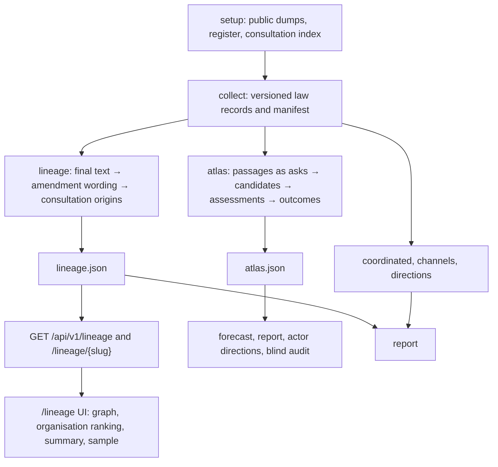

# Repository Consistency Review and Repair Plan

Reviewed 7 October 2026 at `efea0683bb7ff4b812079046c9fb1753adf3947e`.
Tracking: `rev-1i73`. This is a review and proposed repair plan; no analytical behavior
fixes have been applied. The owner subsequently named the project **influence**;
branding changes are tracked separately in `rev-3n26`. Numbered findings are ordered by risk to the truth of the published
results, then reproducibility, onboarding, architecture maintenance and tooling.

Historical scope: reproductions and file links below refer to the reviewed revision
`efea0683bb7ff4b812079046c9fb1753adf3947e`. The later lineage-only cleanup retires Atlas
commands and some referenced files; replay those findings at this revision. See
[implementation status](../implementation-status.md#current-product-scope--7-october-2026)
for the maintained product. Remaining lineage findings are not fixed by that cleanup.

The repository's engineering checks pass, but the displayed results are not yet
defensible as validated influence findings. Three reproduced backend defects can create
unsupported attribution or authorize forecasts using future information. The current
lineage explorer also bypasses the publication distinction required by the documented
architecture, samples a different population from its graph, omits part of the evidence
chain, and presents an all-amendment count as an adopted-wording count. Documentation
cleanup alone cannot repair these issues.

“High” means fix before relying on the affected public findings. “Medium” means a
material reproducibility, usability or maintenance defect. No destructive-data or
critical-security incident was established; none is labelled P0 merely for emphasis.

## Verification and Scope

Three independent review passes covered backend behavior, frontend/API/tooling, and
documentation. The coordinating reviewer independently reran the backend reproductions,
the committed-snapshot count checks and the mock-data path check.

`make check` exited **0** on this checkout:

```text
6 of 6 catalogs valid
0 errors, 0 warnings, 0 notes
TOTAL 8864 statements, 2284 branches, 100% coverage
1400 passed in 113.40s
Test Files 6 passed (6)
Tests 59 passed (59)
Next.js production build completed
Found no known vulnerabilities and no adverse project statuses in 46 packages
found 0 vulnerabilities
```

The command checks formatting, lint, types, tests, build and the configured dependency
audits. It does not establish historical influence accuracy, and it excludes the Docker
gate. The full log for this session is `/private/tmp/atlas-audit-make-check.log`.

The review inventoried 346 tracked files and checked all 34 tracked Markdown files for
ordinary relative file links: zero missing targets in that scan. URLs, heading fragments
and targets containing spaces were outside that automated link check. Current guides,
instructions, architecture, decisions, code paths and tests were read against one
another; historical research was reviewed for its scope and precedence. The current
12-page competition brief was read in full; all three local PDFs were text-extracted.
The superseded brief and extraction playbook were treated as historical/reference inputs,
not independently revalidated external research.

This is not a claim that every line of source is proven correct. No fresh official-data
download, paid Jev request, new human precision audit, full real-law rebuild, Docker
run, or live browser acceptance pass was performed. External legal, licensing, model
availability and historical web-source claims were not independently fact-checked. These
boundaries distinguish static evidence, deterministic reproductions and unperformed
acceptance work.

## How the Current System Actually Works



The two paths are intentional: the current Decisions table records the lineage-only
explorer and retains `atlas.json` for offline consumers. The old `/atlas` page and API
are gone. The defect is that documentation and publication/metric contracts still
describe these paths as one uniform system.

Collection and typed records are useful shared infrastructure. Preserve them. Preserve
the distinction between: wording shared with an amendment; wording surviving in a final
act; an earlier source; and evidence of influence. One does not automatically prove the
others. Do not merge or delete a pipeline merely to make the diagram shorter: its
consumers must be migrated and the owner’s open architecture decision resolved first.

Recommended design: both analytical paths produce claims with exact evidence and a
versioned publication verdict. Backend analysis derives named metrics from those claims.
The explorer, report and audit consume the same publication predicate and metric
definitions. Layout, search, pagination and visual grouping remain frontend concerns.
This is a proposal for repair, not a newly adopted architecture decision.

## Numbered Repair Plan

### 1. R01 — Enforce the Publication Policy on the Live Lineage Path

**High / P1 · Parts 4, 6, 7, 8 and practice loop · `rev-u2rn`.**

**Contradiction:** the [architecture skill](../../.agents/skills/influence-architecture/SKILL.md)
lines 54–56 requires published-only graph edges and excludes unconfirmed claims from
rankings. The current Decisions table retains this policy. Yet
[`OriginMatch.counts_as_origin`](../../backend/src/influence/schemas/lineage.py)
checks chronology and citation status only; there is no publication verdict or accepted
audit attached to a lineage origin. [`build_lineage`](../../backend/src/influence/services/lineage_assembly.py)
directly assembles and counts those origins. The graph and organisation rankings consume
them, while backend README lines 392–393 explicitly say the view has not been audited.
The old Atlas prose-publication guard does not protect this separate path.

**Change:** define an explicit candidate/validated-publication distinction with method,
input and accepted evaluation provenance. Apply it consistently to graph edges, rankings,
headline counts, report and samples. Retain experimental associations in a clearly
labelled exploratory view. If the intended product is explicitly unreviewed exploration,
record that policy change and revise its public claims and normative instructions
together; do not infer that switching the explorer implicitly waived the quality bar.

**Acceptance:** an unreviewed lexical or semantic origin cannot enter a defended
influence ranking. A published claim identifies the policy/evaluation that admitted it.
Audit the precise displayed claim population with independent readers before making
precision claims. Related existing work: `rev-ffsz`, `rev-9nz9`, `rev-sn3u`.

### 2. R02 — Stop Adjacent Text from Creating Unsupported Origin Edges

**High / P1 · Parts 5–6 · `rev-0q9m`. Reproduced.**

[`lineage.py`](../../backend/src/influence/services/lineage.py) lines 268–275 merges
adjacent final-text positions; lines 356–383 attaches each amendment touching any part
to the entire merged phrase. [`origin.py`](../../backend/src/influence/services/origin.py)
lines 225–240 finds a matching subrun, then assigns every carrier of the merged phrase.

Two amendments with completely disjoint twelve-word `alpha` and `beta` strings were
placed next to each other in a final article. A consultation quoting only `alpha`
received both amendment IDs with `counts_as_origin=True`. The second amendment contains
none of that quote. An unrelated early or undated carrier can also corrupt chronology.
Whole credit for genuinely shared wording does not justify this extra relationship.

**Change:** retain per-carrier and per-origin intervals; build origin-to-amendment edges
only where the supporting intervals overlap by a span that meets the matching evidence
contract; a single shared word is insufficient. Segment on carrier-set changes
if useful, while keeping unioned word coverage as a separate count.

**Acceptance:** disjoint adjacent amendments never acquire each other's origins;
partially overlapping amendments receive only supported subintervals; dates apply to
those actual carriers; deduplicated final-word coverage remains unchanged.

### 3. R03 — Judge the Part of an Amendment That Actually Survived

**High / P1 · Parts 4–6 · `rev-h5zb`. Reproduced with a deterministic judge stub.**

[`lineage_jev.py`](../../backend/src/influence/services/lineage_jev.py) line 62 chooses
`phrase_ids[0]` for an amendment. Lines 79–80 judge the whole amendment; lines 98–100
attach any accepted request to that selected adopted phrase. The request in
[`jev_judge.py`](../../backend/src/influence/services/jev_judge.py) carries no final-act
text. The selected phrase is an identifier-order choice, not a supported legal match.

The probe used an amendment with adopted `novel` wording and rejected `lost` wording.
A request for the rejected wording received a positive request-to-amendment answer and
was attached to the unrelated adopted `novel` phrase. This establishes a wiring defect;
it does not estimate the live model’s accuracy.

**Change:** separate request-to-amendment support from request-to-adopted-change support.
Assess the exact surviving change and final span and return the supported phrase IDs and
evidence. Keep a supported request to rejected wording as tabled-only.

**Acceptance:** a request about the rejected half of an amendment creates no adopted
origin. With two surviving phrases, the result selects the supported phrase rather than
the first identifier. Re-evaluate affected semantic output after the repair.

### 4. R04 — Prevent Future Information from Authorizing Forecast Probabilities

**High / P1 · Part 7 and practice loop · existing `rev-iuyf`. Reproduced.**

[`forecast.py`](../../backend/src/influence/services/forecast.py) validates training
through `fit`, then predicts test features directly at lines 183–184 without checking
their observation dates against the split cutoff. A feature need only predate its own
outcome to satisfy `Example`; it may still occur after the simulated prediction date.
[`forecasting.py`](../../backend/src/influence/services/forecasting.py) line 306 validates
all examples before line 317 filters the training history against the requested as-of
date. The separate forecast constructor also accepts an adequate validation object with
empty current history. A direct probe returned `score_type="probability"`, `score=0.0`,
and `missing_features=["historical_outcomes"]` while citing zero past asks.

On twenty synthetic laws, **312 of 416 tested examples had post-cutoff features**;
validation still returned `adequate=True`, Brier **0.000123667** against **0.25** for
prevalence. These deliberately constructed data demonstrate leakage acceptance, not
measured predictive skill on EU laws.

**Change:** define an explicit prediction timestamp for each test event. Build features
using only information available then, and fit only on outcomes known then. Bind
validation to its feature/model definition and time horizon; filter validation evidence
as-of the requested forecast date. Empty or incompatible training evidence must not
authorize a probability.

**Acceptance:** post-cutoff amendments cannot influence validation or predictions;
historical reruns cannot use future completed laws; no law crosses the train/test
boundary; missing history produces a reasoned scenario. Re-run the same frozen evaluation
after repair and replace any affected probability artifact.

### 5. R05 — Make the Random Check Sample the Graph Actually Shown

**High / P1 · Part 8 and practice loop · `rev-ha8p`. Reproduced on both snapshots.**

The graph enables lexical and semantic origins by default. Organisation ranking counts
both. But [`linkPool`](../../frontend/lib/lineage-insights.ts) lines 334–347 excludes
semantic-only phrases. It also samples phrases, which does not give each
origin/amendment edge the same chance when phrases have different numbers of edges.

The Data Governance Act’s leading organisation, DATEV eG, has two adopted phrases
supported solely by semantic origins and zero lexical adopted phrases. Those phrases
cannot be selected by the lexical draw. Its draw covers 8 of 16 phrases with eligible
adopted origins; the AI Act draw covers 34 of 54. Neither denominator establishes how
many links are correct.

**Change:** explicitly define the sampling unit. Sample the same published claim IDs
that feed graph/rankings, with any law/tier stratification and its denominators visible.
If keeping a lexical demonstration, name it as such and do not present it as checking
the complete graph.

**Acceptance:** a semantic-only ranked claim is reachable by the relevant public audit;
multi-origin/multi-carrier phrases have the intended selection probability; seeds
reproduce the exact selected claim IDs. Keep strongest examples separate from a random
precision sample.

### 6. R06 — Restore the Complete Three-Text Evidence Chain

**High / P1 · Parts 1, 5, 6, 8 · `rev-j07w`. Verified by contract and rendering code.**

[`AmendmentAdoption`](../../backend/src/influence/schemas/lineage.py) includes IDs,
authors and counts but no amendment quotation. Source spans identify local records but
the lineage response has no document table with original URLs.
[`lineage-law-browser.tsx`](../../frontend/components/lineage-law-browser.tsx)
lines 150–218 renders submission and final quotes; the middle column is amendment
metadata, limited to six carriers. Generic publisher links in Method cannot open the
actual evidence. This does not fulfil the promised ask/change/final text side by side.

**Change:** preserve original source references, amendment old/new or inserted/deleted
spans and exact origin → amendment → final mappings in the served claim. Show all three
quotations, their actual sources and expandable extra carriers. Keep retrieval date/hash
provenance available without overwhelming the main reading view.

**Acceptance:** independently slice all three source records at their offsets and
recover the displayed quotes. Browser-check original-document links and a phrase with
more than six carriers. A reader must be able to verify the selected claim without
searching local JSON files.

### 7. R07 — Separate Adopted-Word Counts from Tabled-Only Matches

**High / P1 · Parts 7–8 · `rev-is6b`. Reproduced on both snapshots.**

[`lineageFunnel`](../../frontend/lib/lineage-insights.ts) lines 408–445 uses all eligible
origins and `documents_with_origin`, whose backend definition correctly includes both
adopted and tabled-only wording. The UI presents that count as the final step of an
adopted-wording funnel. Its organisation detail uses an adopted-only population, so
even that one card mixes definitions.

| Snapshot | Displayed document count | Documents tied to adopted phrases | Documents read |
| --- | ---: | ---: | ---: |
| AI Act | 203 | 79 | 788 |
| Data Governance Act | 54 | 18 | 1,461 |

These corrected counts retain the existing eligibility rules; they are not newly
audited influence counts and will need recomputation after R02/R03.

**Change:** add an explicitly adopted-only metric and its lexical/semantic split, or
relabel the broad metric and remove it from the adoption funnel. Keep tabled-only
matches useful, but separately named.

**Acceptance:** one adopted-origin document and two tabled-only documents yields one
in the adoption funnel, three only in the all-amendment metric. Lock the population
definition in a cross-consumer contract rather than only a UI snapshot.

### 8. R08 — Make Batch Resume Respect Input and Method Changes

**Medium / P2 · Parts 1 and 3–7 · `rev-ysdc`. Verified by call path.**

[`batch.py`](../../backend/src/influence/services/batch.py) lines 257–278 bypasses
collection whenever any current manifest exists, and skips derived files by matching
`run_id`. It does not check current source/code/options fingerprints or validate the
whole output schema. A second run with `--attachments` can reuse the first run that
skipped attachments. A corrected method or changed Atlas dependency can leave lineage
or directions unchanged. The README accurately describes run-ID reuse; the dangerous
part is its interaction with changed requests and normal collection cache guarantees.

**Change:** use the normal collector’s cache-validation path and record derivative
fingerprints covering actual source artifacts, relevant settings, dependency outputs
and method revision. Keep efficient reuse for unchanged inputs.

**Acceptance:** adding attachments, changing source dumps, changing a method or changing
an Atlas input rebuilds the affected stages without requiring an unrelated forced
network refresh. Invalid same-run output is rejected/rebuilt. An unchanged rerun remains
reused and its timing is measured.

### 9. R09 — Keep Reports Bound to Coherent Run Snapshots

**Medium / P2 · Part 8 · `rev-gxmu`. Verified by call path.**

[`report.load_law`](../../backend/src/influence/services/report.py) lines 215–239 loads
each view independently. Lines 269–270 warn when a run differs, but the later sections
still consume it beside current collection metadata and spend. The warning is valuable;
it does not make the comparison a single reproducible result. Sources may no longer
correspond to the current bundle.

**Change:** reject incompatible views from combined findings and give their rebuild
commands, or explicitly retain immutable historical bundles with independent section
provenance. Validate procedure identity as well as run/dependency identity.

**Acceptance:** schema-valid but incompatible files cannot contribute a current-run
joint headline. A historical report is reproducible from a retained manifest and its
referenced evidence, with no silent cross-run joins.

### 10. R10 — Make the Documented Quickstart Reach a Populated Explorer

**Medium / P2 · Part 8 · `rev-g9tu`. Producer mismatch verified; mock path reproduced.**

Root [`README.md`](../../README.md) lines 35–40 runs `atlas`, `coordinated`, `channels`
and `directions`, then starts the explorer. None writes the only served input,
`lineage.json`. Add `make lineage LAW='AI Act'` to the primary producer/consumer path;
describe Atlas’s offline consumers separately. Correct Makefile line 69’s old
“explorer view” description and backend README lines 31–35’s route claims.

The documented `INFLUENCE_DATA_ROOT=mock-data make dev-backend` is also broken from the
repository root. `uv --directory backend` changes cwd and `default_data_root` leaves
the relative path unchanged. Executed result: `backend/mock-data`, nonexistent, **0
laws**; the actual `../mock-data` contains **2 laws**.

**Change:** establish clear path semantics at the Make/CLI boundary; use a correctly
resolved absolute root in the examples. Repair root, backend, frontend and mock-data
guides together.

**Acceptance:** execute each documented path verbatim in an isolated setup; both the
generated-data path and committed-snapshot path return a nonempty law list, its detail
and visible evidence. Do not claim a fresh network rehearsal until it is performed.

### 11. R11 — Give Analysis Metrics One Definition Across Consumers

**Medium / P2 · Parts 6–8 · `rev-dqfl`. Verified by call path.**

Frontend README lines 7–8 says the app ranks nothing and receives every ranking from
the backend. [`rankOrganisations`](../../frontend/lib/lineage-insights.ts) lines 72–136
actually aggregates origins, chooses eligibility and computes organisation ordering.
The report’s WHO section uses Atlas full-win/assessed-ask counts; the UI ranks lineage
phrase counts. These can be useful different measures, but they are not interchangeable
answers to “who wins.” Backend Member/group credit ordering is separate and is correctly
carried through; it is not the finding here.

**Change:** define named metrics with population, numerator, denominator, unknown-state
behavior, ordering, publication filter and method revision. Prefer deriving substantive
analysis once in backend services and serializing it for the report and UI. If client
derivation is intentionally retained, specify it and test equality wherever the same
metric is claimed. Keep display sorting and filtering local to the UI.

**Acceptance:** the same metric produces the same counts/order in report and explorer.
Phrase survival, whole-amendment adoption, distinct asks and assessed wins have distinct
names. Correct the stale “late/undated” ranking description: current code excludes them.

### 12. R12 — Reconcile the Mandatory Architecture and Decision Documents

**Medium / P2 · All parts · `rev-e1ah`. Documentation contradictions verified.**

Update these together so the next agent follows the implemented and agreed system:

1. The mandatory architecture skill still draws only the ask-first route into the
   explorer. The current Decisions table expressly chooses lineage and leaves the
   future of the older pipeline open. Document both current paths and their contracts.
2. Technical design lines 94–104 points implementers at removed `submission.py`,
   `demo.py` and the evidence workspace. A “ready-to-dispatch” agent assignment also
   points at removed code. Replace active instructions or clearly archive them.
3. D1 says “Local evaluation authorized; no paid API,” while backend commands and
   mock-data provenance document paid Jev runs. Recover and record the actual
   authorization/provider/budget scope and distinguish it from publication approval.
   This mismatch is not evidence that the earlier runs were unauthorized.
4. Put a concise current capability/verification/blocker table before the historical
   status log. The “Next Work” list is explicitly dated 3 October and includes
   completed work and elapsed hackathon deadlines. Keep that history, but stop making
   it the operational handoff.
5. Correct the Decisions pointer to removed `extraction/tables.py`; the contract now
   lives in `schemas/atlas.py`. Correct the lineage schema docstring saying no semantic
   producer exists. Do not rewrite accurately dated old benchmark results.
6. Reconcile plan line 110’s beta-binomial shrinkage requirement with raw-rate sorting
   in `atlas_analysis.py` lines 249–256. Decide whether the implementation is unfinished
   or the policy changed; do not invent a new prior during a documentation fix.
7. Separate threshold development from an independent held-out audit. The existing
   `rev-dt7t` tracks the conflicting threshold/audit schedule. Tuning and validating
   against the same labels cannot establish held-out precision.

**Acceptance:** a new contributor can identify every currently served route, producer,
artifact, publication policy, implementation home and remaining decision without
reconciling old session logs. Current commands run; archived assignments explicitly
defer to current contracts; actual historical approvals are cited, not inferred.

### 13. R13 — Make Container Verification Exercise Real Data Flow

**Medium / P2 · Part 8 and gates · `rev-46te`. Verified by CI/Make wiring.**

[`check-containers`](../../Makefile) requests health, the page shell and the law list;
all can return HTTP 200 with `{"laws":[]}`. Container CI uses ignored `./data` by
default, so a clean checkout need not exercise any law detail or evidence through the
production proxy. `make check` excludes containers although the broad AGENTS gate
description says every gate except dev servers.

**Change:** use committed snapshots or a deterministic fixture; assert a nonempty list,
fetch its law detail, and exercise a data-bearing browser render through the proxy.
Document the separate required Docker gate or provide an explicit complete gate. Ensure
local cleanup happens on failed probes; CI already has an always-cleanup step.

**Acceptance:** breaking detail serving while leaving health/list/page shell successful
fails the gate. An empty fixture fails setup. Both success and failure paths clean up
containers. No Docker result was established in this review.

### 14. R14 — Put the Documentation Validator Under the Dependency Policy

**Medium / P2 · Tooling and supply chain · `rev-hj6v`. Verified by command/config scope.**

[`Makefile`](../../Makefile) lines 40–42 runs
`uv run --no-project --with softschema==0.8.1`. The direct version and age cutoff are
pinned, but the transitive environment is dynamically resolved outside the reviewed
backend lock, its no-build configuration and its vulnerability audit. This contradicts
the repository-wide frozen-dependency/no-source-build policy. It does not establish that
a malicious package was installed or that a source build actually occurred.

**Change:** use a locked tooling project or dependency group, forbid source builds and
include the actual lock in audit coverage. Keep the single Ruff/Biome policy intact.

**Acceptance:** a clean installation uses the reviewed lock without changing resolution;
source-only dependencies are rejected; subsequent execution works offline with installed
dependencies; audits cover every installed validator dependency.

## Lower Priority Cleanup

These belong to R12 or their already existing beads after the correctness work:

- `frontend/lib/api-client.ts` forces `cache: "no-store"` despite API cache support;
  `rev-mk2n` already tracks the intended client change. Do not treat backend ETag tests as
  proof that the browser currently uses them.
- `INFLUENCE_PUBLIC_URL` is documented for builds but not passed through Docker/Compose
  build arguments. Add propagation if containerized public metadata is supported.
- Remove stale links-from-workspace prose and clarify “real run,” “fixture test,”
  “snapshot render” and “browser verified” as different evidence scopes.
- Correct “standalone ships no node_modules”: it ships a traced subset. Do not change
  correct standalone deployment merely to fit that comment.
- The dated research calls leave-one-legislature-out “temporal validation,” although
  it need not train only on the past. Correct that historical label. Its evidence
  README also offers unpinned `uv --with` replay dependencies; provide a pinned
  historical environment or explicitly describe the reproduction limit.
- Reconcile stale/open beads with merged implementation evidence. `rev-iuyf` remains a
  live defect despite partial fixes; other old descriptions mention now-built commands
  or fixed group-at-tabling support. Check before closing or duplicating them.

## Implementation Order and Completion Bar

First, stop presenting unvalidated associations as defended results (R01). Implement
precise evidence joins and semantic adoption checks (R02/R03) alongside the complete
evidence contract (R06). Fix the forecast leakage independently (R04). Recompute affected
snapshots, then repair metric populations and the sample (R07/R05), with shared analysis
definitions (R11). Independently evaluate the resulting claim population; do not audit
obsolete outputs before the attribution fixes.

Cache and run coherence (R08/R09) must land before relying on regenerated results.
Onboarding/docs (R10/R12), populated container verification (R13) and the tooling lock
(R14) can proceed in parallel with the correctness work. Use one concern per PR, keep
all current tests green and add the missing invariants described above. Document actual
commands/results and the still-unperformed real-data/audit checks on each bead.

The completion bar is stronger than `make check`: a clean checkout follows its README
to a populated explorer; all displayed claims have inspectable three-part evidence;
graph, ranking and sample agree on eligibility; report inputs form a coherent snapshot;
held-out evaluation respects time; and real-law precision is measured on the claims
actually presented. Until then, wording associations remain explicitly exploratory.

## Findings Not Counted as New Defects

- The first brief, old Influence Graph primer, uploaded technical plan, dated research
  and historical calculation handoff are expressly superseded or snapshots. Their
  different choices are not each a current contradiction.
- Missing meetings, votes, public-voice comparison and multilingual/legal-semantic
  validation are reported limitations or unfinished scope. Their existence alone is not
  proof of a code bug; the public product must preserve those qualifications.
- Current group-at-tabling logic exists and names its legacy-data fallback. Old notes
  claiming latest-group-only behavior should not be repeated as a current code finding.
- Thin read-only API routes, slug validation, explicit unknown/coverage states, exact
  source offsets, atomic output writes, nonroot containers, pinned action/image digests,
  strict typing and gate probes are useful controls. They do not establish the missing
  cross-stage attribution and time invariants.

<!-- Review evidence is bound to the source revision above. Line references describe that revision. -->

## Reproduction Recipes

Run the snapshot check from the repository root with the installed Node runtime:

```sh
node --experimental-strip-types --input-type=module <<'JS'
import fs from 'node:fs';
import {rankOrganisations, lineageFunnel, linkPool} from './frontend/lib/lineage-insights.ts';
import {prepareLineage} from './frontend/lib/lineage.ts';
for (const slug of fs.readdirSync('mock-data/laws')) {
  const view = JSON.parse(fs.readFileSync(`mock-data/laws/${slug}/lineage.json`));
  const adopted = new Set(view.adopted_phrases.map(p => p.phrase_id));
  const origins = view.origins.filter(o => adopted.has(o.phrase_id)
    && o.eligibility === 'ask_first' && !o.is_citation);
  console.log({slug,
    displayedDocuments: lineageFunnel(view, rankOrganisations(view))
      .find(s => s.id === 'documents').part,
    adoptedDocuments: new Set(origins.map(o => o.document_id)).size,
    eligiblePhrases: new Set(origins.map(o => o.phrase_id)).size,
    samplePool: linkPool(prepareLineage(view).adopted).length,
    leader: rankOrganisations(view).rows[0]});
}
JS
```

Run the three backend probes from the repository root with the installed locked
environment. They use existing fixture factories, a temporary directory and a fake
Jev transport; they make no provider call and do not modify data bundles.

```sh
uv run --directory backend --locked python - <<'PY'
import sys
sys.path.insert(0, 'tests')
from dataclasses import replace
from datetime import UTC, datetime
from pathlib import Path
from tempfile import TemporaryDirectory
from test_lineage import amendment, article, sentence, mep
from test_origin import document
from test_lineage_jev import _world, _judge, _submitters
from test_jev_judge import FakeJev
from test_lineage_assembly import ACME
from influence.services.lineage import adopt, adopt_records, Rarity
from influence.services.origin import find_origins
from influence.services.lineage_jev import reworded_origins
from influence.services.forecast import Example, Features, rolling_splits, validate

left, right = sentence('alpha', 12), sentence('beta', 12)
amendments = [amendment(1, left), amendment(2, right, authors=('actor:mep:2',))]
articles = [article('Proposal', sentence('old', 30), 'proposal'),
            article('Final', left + ' ' + right)]
adoption = adopt_records(amendments, articles, [mep(1, 'PPE'), mep(2, 'S&D')])
origins = find_origins(adoption.phrases, adoption.adoptions, [document(text=left)],
                      rarity=Rarity.of(a.text for a in articles))
print('ADJACENT', origins[0].span.text, origins[0].amendment_ids,
      origins[0].counts_as_origin)

examples = [Example(f'{2000+law}/0001(COD)',
    Features('winner' if j % 2 else 'loser', 1,
             datetime(2000+law, 12, 30, tzinfo=UTC)),
    datetime(2000+law, 12, 31, tzinfo=UTC), bool(j % 2))
    for law in range(20) for j in range(26)]
late = sum(examples[i].features.observed_at > split.as_of
           for split in rolling_splits(examples, 4) for i in split.test)
print('FORECAST', late, validate(examples, 4))

request = 'We ask for lost2 lost5 lost8 to be included.'
world = _world(('8', request, datetime(2099, 1, 1, tzinfo=UTC), ACME.actor_id))
first = world.amendments[0]
world = replace(world, amendments=(first.model_copy(update={
    'new_text': first.new_text + ' ' + sentence('lost', 12)}),))
adoption = adopt(world)
with TemporaryDirectory() as directory:
    fake = FakeJev()
    origins, _ = reworded_origins(world, adoption.adoptions,
        _judge(Path(directory), fake), submitters=_submitters(world))
    found = next(o for o in origins if o.document_id == 'doc:hys_attachment:8')
    phrase = next(p for p in adoption.phrases if p.phrase_id == found.phrase_id)
    print('SEMANTIC', found.span.text, phrase.text, found.counts_as_origin,
          sorted(fake.states[0]))
PY
```

Expected at the reviewed revision: ADJACENT names amendments 1 and 2 for the alpha-only
quote; FORECAST reports 312 late test features and adequate validation; SEMANTIC maps
the lost-wording request to the novel-wording final phrase with no final text in the
judge state. These are intentionally failing invariants, not passing acceptance tests.
